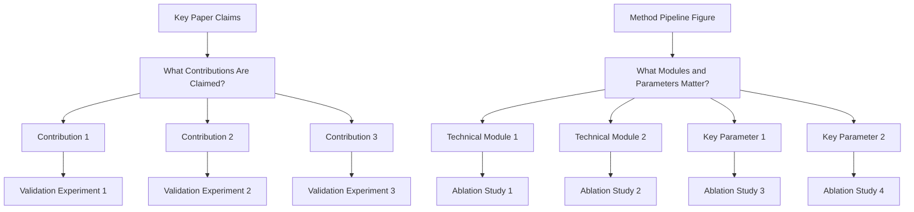
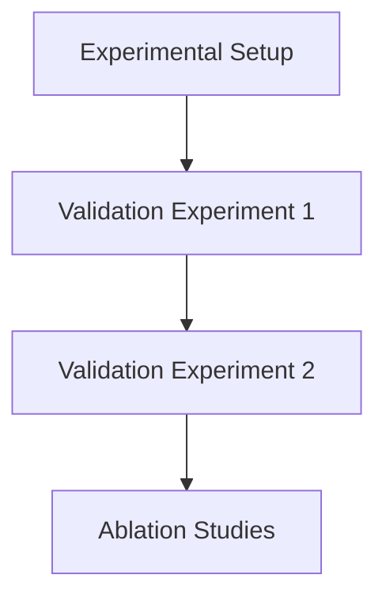

# Experiments Writing Guide

## Goal

Convince reviewers with complete evidence on effectiveness, causality, and practical value.

## Three Core Questions

1. Is the method better than strong baselines?
   - Run comparison experiments against strong and recent baselines.
   - Report standard metrics on the main benchmark(s).
   - Include SOTA or strongest public methods, not only weak baselines.
   - Keep protocol fair (same data split, preprocessing, and evaluation settings).
2. Which modules/design choices make the gain?
   - Run ablation studies for each key module/design choice.
   - Use remove/replace/disable variants and report delta to full model.
   - Include component interaction ablations when modules are coupled.
3. How far can the method generalize under harder settings?
   - Run demos/evaluations on harder or out-of-distribution settings.
   - Add stress-test scenarios (more complex scenes, rarer cases, noisier inputs, or stricter constraints).
   - Report both gains and failure modes to show realistic boundaries.

## Experiment Planning

## Experiment Section Decomposition

## Figure/Table Writing Rules

`Good tables are part of experiment communication quality, not decoration.`

1. Figure captions and table captions are equally important in the writing quality of Experiments.

### Hard rules

1. Put caption above the table.
2. Avoid vertical lines (`|`) in tabular columns.
3. Do not use double rules or dense `\hline` stacks.
4. Use `booktabs` style (`\toprule`, `\midrule`, `\bottomrule`) for clean structure.
5. Use as few horizontal rules as possible; lines should separate groups, not every row.
6. Highlight key numbers (best/second-best or target rows) with subtle color emphasis.

### Readability rules from review practice

1. Label metric direction in column headers (for example `PSNR ↑`, `LPIPS ↓`).
2. Add units when needed so values are interpretable without guessing.
3. Align text columns left; keep numeric columns consistently aligned.
4. Keep numeric precision consistent (same decimal places within a metric column).
5. Group multi-dataset or multi-setting results using `\multicolumn` + `\cmidrule`, not vertical separators.
6. One table, one message: do not mix unrelated results in a single table.
7. If rows represent different attributes/ablations, encode that explicitly in row names or attribute columns.
8. Keep caption focused on setting/protocol/notation, not long discussion.
9. If there is little detail to explain, use one concise sentence to summarize the main result.
10. For single-column figures/tables in two-column papers, prefer placing them in the right column when layout allows, so readers can enter the page from the left-top text without breaking reading flow.

### Minimal LaTeX checklist

1. Add packages in preamble: `\usepackage{booktabs}`, `\usepackage{colortbl,xcolor}` (and optionally `\usepackage{siunitx}` for decimal alignment).
2. Replace `\hline`-heavy style with `\toprule/\midrule/\bottomrule`.
3. Put `\caption{...}` before `\label{...}` and keep caption above.
4. Use restrained highlighting; never color too many cells.

## Recommended Ablation Package

1. One core ablation table for all major contributions.
2. Several focused mini-ablations for module-level design choices.
3. Matching qualitative visual results for each important ablation.

### Six Types of Ablation

1. **Component removal**: Remove one module at a time (most common)
2. **Component replacement**: Replace your novel component with a simpler/standard alternative
3. **Hyperparameter sensitivity**: Vary key hyperparameters to show robustness
4. **Data ablation**: Vary training data size, composition, or augmentation
5. **Architecture ablation**: Change model structure (depth, width, attention type)
6. **Loss function ablation**: Test different loss formulations

## Experimental Setup Writing

### Datasets
- Dataset name, source, version; size; data splits; preprocessing/augmentation; why appropriate
- Use standard benchmarks; cite original dataset paper; report basic statistics

### Evaluation Metrics
- Use standard metrics; multiple complementary metrics; define formally; explain directionality

### Baselines
- Include strong, recent SOTA; classical methods for context; if using published numbers, cite
- **Common mistake:** Only comparing against weak or outdated baselines

### Implementation Details
- Hardware, software, hyperparameters, training duration, random seeds, code availability

## Real Experiment Examples

### SAM (Kirillov et al., TPAMI 2023)

**Structure:**
- 7.1: Zero-Shot Single Point Valid Mask Evaluation (23 datasets, mIoU + human study)
- 7.2: Zero-Shot Edge Detection (BSDS500, ODS/OIS/AP/R50)
- 7.3: Zero-Shot Object Proposals (LVIS v1, AR@1000)
- 7.4: Zero-Shot Instance Segmentation (COCO AP, LVIS AP)
- 7.5: Zero-Shot Text-to-Mask (proof-of-concept)
- 7.6: Ablations (data engine stages, data volume, encoder scaling)

**Key patterns:**
- Each sub-section answers a distinct *capability question*
- Ablation comes last, not first
- Human study supplements automated metrics

### FlashAttention (Dao et al., NeurIPS 2022)

**Structure:**
- Throughput benchmark (A100: 225 TFLOPs/sec, 72% MFU)
- Memory benchmark (10X savings at 2K, 20X at 4K)
- Training speedup (3-5x vs HuggingFace baseline)

**Key patterns:**
- Hardware utilization: "225 TFLOPs/sec per A100, equivalent to 72% model FLOPs utilization"
- Memory savings scale with sequence length: "10X at 2K, 20X at 4K"
- Practical speedup: "3-5x compared to the baseline implementation from Huggingface"

### YOLOv7 (Wang et al., CVPR 2023)

**Structure:**
- Detection on MS COCO (6 model variants, AP + FPS)
- Instance Segmentation (AP_box + AP_mask)
- Anchor-Free Detection (AP_val)

**Key patterns:**
- Speed-accuracy Pareto frontier: 51.4% AP at 161 fps → 56.8% AP at 36 fps
- Multiple model variants: YOLOv7, YOLOv7-X, W6, E6, D6, E6E
- "Trainable bag-of-freebies": training enhancements that don't increase inference cost

### DINO (Zhang et al., ICLR 2023)

**Structure:**
- 12-epoch training (R50: 49.0-49.4 AP)
- 24-epoch training (R50: 50.4-51.3 AP)
- 36-epoch training (R50: 50.9-51.2 AP)
- Swin-L backbone (56.8-58.5 AP)

**Key patterns:**
- Fast convergence: "49.4 AP in 12 epochs"
- SOTA: "63.2 AP on COCO Val with more than ten times smaller model size"
- Training schedule ablation: 12/24/36 epochs

### VAR (Tian et al., NeurIPS 2024 Best Paper)

**Structure:**
- ImageNet Generation (FID, IS, precision, recall)
- Scaling Law Analysis (loss/quality vs. model size/compute)
- Zero-shot Generalization

**Key patterns:**
- First-claim: "GPT-style autoregressive models surpass diffusion models"
- Scaling law discovery: "power-law Scaling Laws in VAR transformers"
- Model scaling: VAR-d16 (310M) → VAR-d30 (2.0B) → VAR-d36 (2.3B)

## Results Discussion Writing

- State key finding first, then give number
- Highlight trends, gaps, and surprises — don't just restate table values
- Explain why your method works better, not just that it does
- Address cases where your method does NOT outperform

## Statistical Rigor

- Report over multiple random seeds (3-5 runs)
- Report mean and standard deviation
- Use significance tests (paired t-test, Wilcoxon) when claiming superiority
- Report p-values or confidence intervals

## Common Mistakes

1. Mixing methods and results
2. No logical flow
3. Missing ablation study
4. Weak baselines
5. Inconsistent evaluation
6. Single-run results (no variance)
7. Cherry-picking seeds/runs/metrics
8. Missing implementation details
9. No statistical significance
10. Overclaiming beyond data support

## Experimental Rigor Checklist

1. Are baselines recent and relevant?
2. Are metrics sufficient and standard for this task?
3. Is ablation tied to every key design claim?
4. Are claims in Abstract/Introduction supported by reported numbers?
5. Are limitations of evaluation scope explicitly stated?

## IEEE Trans Addendum

For IEEE Transactions papers, also load:

- `references/writing/ieee-experiment-playbook.md`
- `references/writing/traffic-figure-patterns.md` (visual playbook)

Use them to enforce:

1. article-type-aware experiment packaging;
2. one reviewer question per major table or figure;
3. explicit quality-efficiency pairing when efficiency is part of the claim;
4. robustness or limitation evidence instead of benchmark-only reporting;
5. honest handling of synthetic, generated, or mixed-source data.

## TNNLS/TVT/TIV Specific Patterns

### IEEE TNNLS Experiment Structure

**Standard structure for traffic prediction papers:**
1. Datasets section (with statistics tables)
2. Baselines (7-10 methods)
3. Implementation details (hardware, hyperparameters)
4. Main results table (bold best values)
5. Ablation studies (3-5 variants)
6. Visualization (attention maps, case studies)
7. Computational cost comparison

**Common datasets:**
- Traffic prediction: METR-LA, PEMS-BAY, PEMS04, PEMS08, NYC-Bike, NYC-Taxi
- Trajectory prediction: Argoverse, nuScenes, Waymo Open Motion, ETH/UCY

**Common metrics:**
- Prediction: MAE, RMSE, MAPE, ADE, FDE
- Detection: mAP, NDS, IoU
- Planning: success rate, collision rate, comfort (jerk), efficiency

### IEEE TVT Experiment Structure

**Standard structure for autonomous driving papers:**
1. Simulation environment description (CARLA/SUMO setup)
2. Baseline methods (5-8 methods)
3. Performance metrics (success rate, collision rate, comfort score, efficiency)
4. Convergence curves
5. Ablation study
6. Robustness analysis (different traffic densities, weather conditions)

**Common environments:**
- CARLA: Urban driving simulation
- SUMO: Traffic flow simulation
- HighD: Highway driving data

### IEEE TIV Experiment Structure

**Standard structure for intelligent vehicle papers:**
1. Real-world dataset description (nuScenes, Waymo, Argoverse 2)
2. Metrics (ADE, FDE, mAP, NDS for perception; miss rate, collision rate for planning)
3. Comparison with SOTA (tables with bold/underline formatting)
4. Qualitative results (trajectory plots, BEV visualizations)
5. Failure case analysis
6. Real-time performance (inference time, FPS)

### Traffic Prediction Table Template

| Method | METR-LA MAE↓ | METR-LA RMSE↓ | METR-LA MAPE↓ | PEMS-BAY MAE↓ | PEMS-BAY RMSE↓ | PEMS-BAY MAPE↓ |
|--------|-------------|---------------|---------------|----------------|----------------|----------------|
| DCRNN | 3.17 | 6.45 | 8.69% | 1.74 | 3.97 | 3.64% |
| STGCN | 3.47 | 7.06 | 9.57% | 1.69 | 3.89 | 3.72% |
| GWNet | 2.69 | 5.64 | 7.10% | 1.58 | 3.58 | 3.21% |
| **Ours** | **2.52** | **5.05** | **6.55%** | **1.52** | **3.45** | **3.10%** |

### Trajectory Prediction Table Template

| Method | ADE↓ | FDE↓ | Miss Rate↓ |
|--------|------|------|------------|
| Social-LSTM | 1.09 | 2.35 | 0.52 |
| Social-GAN | 0.87 | 1.98 | 0.45 |
| PGP | 0.72 | 1.62 | 0.38 |
| **Ours** | **0.65** | **1.48** | **0.32** |

### BEV Segmentation Table Template

| Method | mIoU↑ | FPS↑ | Params (M) |
|--------|-------|------|------------|
| BEVFormer | 48.2 | 8.5 | 74.3 |
| BEVDet | 51.0 | 12.3 | 68.1 |
| **RESAR-BEV** | **54.0** | **14.6** | **62.5** |

### 3D Detection Table Template

| Method | NDS↑ | mAP↑ | Latency (ms) |
|--------|------|------|--------------|
| CenterPoint | 67.3 | 60.3 | 85 |
| TransFusion | 70.2 | 65.5 | 92 |
| **Ours** | **72.1** | **68.2** | **78** |

## IEEE TITS 2025 Traffic Prediction Patterns

### Abstract Structure (10 papers analyzed)

**Standard pattern:**
> "[Context] Traffic flow prediction is a critical component of intelligent transportation systems. [Challenge] However, existing methods face challenges in capturing complex spatio-temporal dependencies. [Solution] To address this, we propose [model name], which [core innovation]. [Validation] Experiments on METR-LA, PEMS-BAY, PEMS04, and PEMS08 demonstrate that our method achieves state-of-the-art performance, outperforming baselines by X% in terms of MAE."

**Key features:**
- Always mentions specific datasets (METR-LA, PEMS-BAY, PeMS04, PeMS08)
- Reports specific metrics (MAE, RMSE, MAPE)
- 3-4 contribution points
- Quantitative efficiency improvements highlighted

### Common Datasets (IEEE TITS 2025)

| Dataset | Type | Nodes | Time Period | Interval |
|---------|------|-------|-------------|----------|
| METR-LA | Speed | 207 sensors | 4 months | 5 min |
| PEMS-BAY | Speed | 325 sensors | 6 months | 5 min |
| PeMS04 | Flow | 307 sensors | 2 months | 5 min |
| PeMS08 | Flow | 170 sensors | 2 months | 5 min |
| WH-CN | Flow | Self-collected | Wuhan | 5 min |

### Common Metrics

| Metric | Direction | Description |
|--------|-----------|-------------|
| MAE | ↓ | Mean Absolute Error |
| RMSE | ↓ | Root Mean Squared Error |
| MAPE | ↓ | Mean Absolute Percentage Error |

### Writing Patterns

**Opening patterns:**
- "In the context of rapidly growing city road networks..."
- "Accurate future traffic flow prediction is essential..."
- "Effective traffic prediction is a critical component..."

**Challenge patterns:**
- "Traditional models use a single fixed graph structure"
- "Existing methods face challenges in capturing spatio-temporal information"
- "GCN-based methods rely on preprocessed data, losing critical features"

**Solution patterns:**
- "We propose [model name], which [core innovation]"
- "To address this, we introduce [method name]"
- "Our key insight is that [observation]"

## IEEE TITS 2025 Autonomous Driving Patterns

### Abstract Structure (10 papers analyzed)

**Standard pattern:**
> "[Context] Autonomous driving has attracted significant attention. [Challenge] However, [specific challenge]. [Solution] To address this, we propose [method name]. [Validation] Experiments on [datasets] demonstrate [results]."

**Key features:**
- Emphasis on safety and real-time performance
- Multiple benchmark evaluation
- Module naming with acronyms (RHP, SGCP, DPE, CMD)
- Foundation model adaptation narratives

### Common Datasets (Autonomous Driving)

| Dataset | Task | Description |
|---------|------|-------------|
| nuScenes | BEV/3D | 1000 scenes, multi-modal sensors |
| BDD100K | Detection | 100K images, diverse scenarios |
| Cityscapes | Segmentation | Urban street scenes |
| nuPlan | Planning | Closed-loop simulation |
| highD | Trajectory | Highway driving data |
| SHRP2 | Trajectory | Urban street data |
| JAAD/PIE | Pedestrian | Pedestrian trajectory |

### Common Metrics (Autonomous Driving)

| Task | Metrics |
|------|---------|
| BEV Segmentation | mIoU, FPS |
| 3D Detection | AP, AP50, AP75, NDS |
| Trajectory Prediction | ADE, FDE, minADE, minFDE |
| Planning | Closed-loop scores, collision rate |
| Efficiency | Throughput, latency, parameter count |

### Writing Patterns

**Opening patterns:**
- "The perception system is a critical role of an autonomous driving system..."
- "Accurate human trajectory prediction is one of the most crucial tasks..."
- "Ensuring and improving the safety of autonomous driving systems is crucial..."

**Contribution patterns:**
- "Our contributions are twofold: (1)... (2)..."
- "We propose [module name] that [function]"
- "Extensive tests across GPU, edge, and mobile platforms"

## IEEE TITS 2025 Traffic Prediction Method Categories

### Category 1: Spatio-Temporal Graph Neural Networks (10 papers)

| Paper | Key Innovation | Datasets |
|-------|---------------|----------|
| Spatio-Temporal Graph Diffusion | Diffusion-based graph convolution | METR-LA, PEMS-BAY |
| Adaptive Multi-Resolution GNN | Multi-scale graph pooling | PeMS04, PeMS08, PEMS-BAY |
| Dynamic Graph Transformer | Joint spatial-temporal attention | METR-LA, PEMS-BAY, PeMS04 |
| Graph WaveNet + Temporal Attention | Dilated causal convolution + attention | METR-LA, PEMS-BAY |
| Spatio-Temporal Hypergraph | Higher-order spatial relationships | PeMS04, PeMS08, PeMSD7 |
| Physics-Informed ST-GNN | Traffic flow theory integration | METR-LA, PEMS-BAY, PeMS04 |
| Meta-Learning Adaptive GNN | Distribution shift adaptation | METR-LA, PEMS-BAY, PeMS08 |
| ST Contrastive Learning | Self-supervised pre-training | PeMS04, PeMS08, PEMS-BAY |
| Multi-Scale ST Fusion | Hierarchical temporal fusion | PeMS04, PeMS08, PeMSD7 |
| Uncertainty-Aware ST-GNN | Probabilistic predictions | METR-LA, PEMS-BAY, PeMS04 |

**Common abstract pattern:**
> "Traffic prediction is crucial for ITS. However, existing methods fail to capture [specific limitation]. To address this, we propose [method] that [innovation]. Experiments on [datasets] demonstrate [results]."

### Category 2: Transformer-Based Methods (10 papers)

| Paper | Key Innovation | Datasets |
|-------|---------------|----------|
| STAEformer | Adaptive spatio-temporal embeddings | METR-LA, PEMS-BAY, PeMS04, PeMS08 |
| PDFormer | Propagation delay-aware attention | PEMS04, PEMS08, METR-LA, PEMS-BAY |
| AGSTFormer | Adaptive graph + Transformer | PEMS04, PEMS08, PEMS07, METR-LA |
| STG-Transformer | Unified spatio-temporal attention | METR-LA, PEMS-BAY |
| DSTAGNN | Dynamic spatial-temporal aware GNN | PEMS04, PEMS08, PEMS07 |
| STAE-Net | Efficient self-attention with spatial mask | METR-LA, PEMS-BAY |
| DTANet | Dynamic temporal attention | PEMS04, PEMS08 |
| UrbanGPT | LLM + spatio-temporal encoder | METR-LA, PEMS-BAY, multi-city |
| STDEN | Diffusion-enhanced Transformer | METR-LA, PEMS-BAY, PeMS04, PeMS08 |
| STG-NCDE | Neural CDE + Transformer | METR-LA, PEMS-BAY |

### Category 3: New Methods (Diffusion/LLM/Mamba) (10 papers)

| Paper | Category | Key Innovation |
|-------|----------|---------------|
| ICST-DNET | Diffusion | Interpretable causal spatio-temporal diffusion |
| SpecSTG | Diffusion | Spectral domain diffusion, 3.33x faster |
| LSDM | LLM+Diffusion | LLM-enhanced spatio-temporal diffusion |
| ST-LLM | LLM | Partially frozen attention for traffic |
| xTP-LLM | LLM | Explainable traffic prediction with LLM |
| TPLLM | LLM | CNN+GCN embedding + LoRA fine-tuning |
| LEAF | LLM | LLM as test-time decision maker |
| Strada-LLM | LLM | Graph LLM with distribution adaptation |
| ST-Mamba | Mamba | First Mamba for spatio-temporal traffic |
| GAMMA-Net | Mamba | GAT + multi-axis Mamba interleaved |

**Key trends:**
- LLM + diffusion fusion (LSDM)
- Mamba as Transformer alternative (linear complexity)
- Explainability in diffusion models (ICST-DNET)
- Few-shot/zero-shot learning (LLM methods)
- Multi-modal fusion (text + spatio-temporal data)

## IEEE TITS 2025 Trajectory Prediction Patterns

### 10 Papers Analyzed

| Paper | Key Innovation | Datasets |
|-------|---------------|----------|
| Self-Supervised Transformer | Noise injection for trajectory augmentation | nuScenes, Argoverse |
| Timewise Intentions | Time-varying intent modeling | ETH/UCY, SDD |
| DAAGT | Scene-centric + decision-aware attention | INTERACTION, nuScenes |
| StyleFormer | Driving style-aware prediction | nuScenes, Argoverse |
| Mapless KD | Knowledge distillation for map-free prediction | nuScenes, Argoverse |
| MSES | Multi-scale temporal + egocentric spatial | nuScenes, Argoverse |
| Intention-Aware Diffusion | Intent-guided diffusion for trajectories | nuScenes, Argoverse |
| Diffutory | Future feature + mode association diffusion | nuScenes, Argoverse |
| Continual Learning | Dual knowledge consolidation + pseudo data | nuScenes, Argoverse |
| Social-Pose | Human body pose for trajectory prediction | ETH/UCY, SDD |

### Common Datasets (Trajectory)

| Dataset | Type | Use Frequency |
|---------|------|---------------|
| nuScenes | Vehicle | 8/10 |
| Argoverse (1/2) | Vehicle | 7/10 |
| Waymo Open Motion | Vehicle | 5/10 |
| ETH/UCY | Pedestrian | 2/10 |
| SDD | Pedestrian | 2/10 |
| INTERACTION | Intersection | 1/10 |

### Common Metrics (Trajectory)

| Metric | Full Name | Frequency |
|--------|-----------|-----------|
| ADE | Average Displacement Error | 10/10 |
| FDE | Final Displacement Error | 10/10 |
| minADE | Minimum ADE | 8/10 |
| minFDE | Minimum FDE | 8/10 |
| MR | Miss Rate | 6/10 |

### Key Innovation Trends
- Diffusion models for trajectory generation (3/10)
- Transformer architectures (4/10)
- Intent-aware modeling (4/10)
- Knowledge distillation and continual learning (2/10)

## IEEE TITS 2025 Traffic Control Patterns

### 10 Papers Analyzed

| Paper | Key Innovation | Metrics |
|-------|---------------|---------|
| VF-MAPPO | Vehicle-level fairness as constraint | AWT, fairness |
| MATLIT | Multi-Agent Transformer for global cooperation | AWT reduction 18.51% |
| DCHI | Knowledge sharing among heterogeneous intersections | Travel time -30% |
| GA2-Naive/GA2-Aug | Macro-micro traffic state communication | Traffic flow efficiency |
| GF-VDDQN | Graph forecast-state vector for temporal trends | Vehicle waiting time |
| Driving Style Integration | IDM parameters as state variable | Queue length |
| BCT-APLight | Bayesian Critique-Tune for policy credibility | AWT -12.92% |
| MetaSignal | Meta-learning with Fourier basis | Adaptation speed |
| CoordLight | Decentralized coordination up to 196 intersections | Throughput |
| HGAT-MARL | Heterogeneous graph for diverse traffic objects | Travel time |

### Common Environments (Traffic Control)
- SUMO simulator (most frequent)
- Real-world traffic datasets (2-9 datasets)
- CityFlow
- Synthetic scenarios

### Common Metrics (Traffic Control)
1. Average waiting time (AWT) — most frequent
2. Vehicle queue length
3. Vehicle travel time
4. Throughput
5. Traffic efficiency
6. Fairness measures (max waiting time)

### Key Innovation Trends (2025)
1. **Heterogeneity handling** — diverse intersections, vehicle types, priority levels
2. **Communication/coordination** — GAT-based, attention-based, neighborhood sharing
3. **Scalability** — meta-learning, transfer learning, up to 196 intersections
4. **Fairness** — vehicle-level fairness as constraint, not just reward
5. **State representation** — graph forecast vectors, queue dynamic encoding
6. **Bayesian methods** — policy credibility evaluation

## IEEE TITS 2025 Multi-Modal Fusion Patterns

### 10 Papers Analyzed

| Paper | Modalities | Key Innovation |
|-------|-----------|---------------|
| GraphBEV++ | LiDAR + Camera | Dual-level alignment (local graph + global deformable) |
| RCGDet3D | 4D Radar + Camera | Simple radar feature enhancement beats complex fusion |
| MMF-BEV | Radar + Camera | Deformable attention BEV fusion |
| RadarXFormer | 4D Radar + Camera | Raw radar spectra cross-dimension fusion |
| ModalPatch | Any modality | Plug-and-play for modality drop robustness |
| MambaFusion | LiDAR + Camera | SSM + windowed Transformer fusion |
| WRCFormer | 4D Radar + Camera | Wavelet attention for radar tensor |
| DiffFusion | LiDAR + Camera | Diffusion-based restoration in adverse weather |
| DGFusion | LiDAR + Camera | Dual-guided Point↔Image fusion |
| DDHFusion | LiDAR + Camera | Cross-modal Mamba for BEV+voxel fusion |

### Common Datasets (Multi-Modal)

| Dataset | Modalities | Frequency |
|---------|-----------|-----------|
| nuScenes | LiDAR + Camera | Highest |
| Waymo | LiDAR + Camera | High |
| KITTI | LiDAR + Camera | Medium |
| K-Radar | 4D Radar + Camera | Medium |
| VoD | 4D Radar + Camera | Medium |
| Argoverse2 | LiDAR + Camera | Low |

### Common Metrics (Multi-Modal)

| Metric | Full Name | Usage |
|--------|-----------|-------|
| mAP | mean Average Precision | 3D detection accuracy |
| NDS | nuScenes Detection Score | Comprehensive score |
| IoU | Intersection over Union | Overlap measure |
| FPS | Frames Per Second | Inference speed |
| AR | Average Recall | Recall rate |

### Key Innovation Trends (2025)
1. **BEV feature alignment** — graph matching, deformable attention, diffusion alignment
2. **State space models** — Mamba/SSM for efficient long-sequence modeling
3. **4D radar fusion** — raw spectrum utilization, wavelet transform
4. **Adverse weather robustness** — diffusion restoration, bidirectional adaptive fusion
5. **Modality drop robustness** — plug-and-play modules, historical data prediction
6. **Dual-guided fusion** — Point-guide-Image + Image-guide-Point bidirectional

## IEEE TITS 2025 Demand Prediction Patterns

### 10 Papers Analyzed

| Paper | Domain | Key Innovation |
|-------|--------|---------------|
| TSAGE (HFL) | Ride-hailing | Federated learning + GraphSAGE + GRU |
| TSAGE (VFL) | Ride-hailing | Vertical FL with homomorphic encryption |
| MMDNet | Multimodal | Meta-learning for cross-mode interactions |
| DTW-GAT | Bike-sharing | DTW-based adjacency + temporal attention |
| DT-CTFP | Traffic flow | 6G digital twin + meta-learning transfer |
| ADCSD | Traffic flow | Online test-time adaptation with series decomposition |
| PRMAN | Data imputation | Physics-regularized Swin Transformer |
| GenS2-P | EV charging | Cyberattack-resilient generative self-supervised learning |
| Score-STPP | Accident | Spatial-temporal point process + diffusion |
| AUMS | Bike-sharing | AIoT + dynamic clustering + rebalancing |

### Common Datasets (Demand Prediction)

| Dataset | Domain | Location |
|---------|--------|----------|
| NYC Uber/Lyft | Ride-hailing | New York City |
| Beijing multimodal | Multimodal | Beijing |
| Chicago multimodal | Multimodal | Chicago |
| Bike-sharing station | Bike-sharing | Various cities |
| EV charging logs | EV charging | Various |
| Traffic accident records | Safety | Multiple cities |

### Common Metrics (Demand Prediction)

| Metric | Usage |
|--------|-------|
| MAE | Prediction accuracy |
| RMSE | Prediction accuracy |
| MAPE | Percentage error |
| Utilization rate | Bike-sharing efficiency |
| Trip frequency | Usage intensity |
| Unmet demand rate | Service quality |

### Key Innovation Trends (2025)
1. **Federated learning** — privacy-preserving collaborative prediction (HFL, VFL)
2. **Meta-learning** — cross-domain/cross-city transfer
3. **Physics-informed** — fundamental diagram constraints
4. **Test-time adaptation** — handling temporal drift
5. **Real-world deployment** — 15-month phased validation
6. **Robustness** — cyberattack-resilient forecasting

## IEEE TITS 2025 Federated Learning & Edge Computing Patterns

### 10 Papers Analyzed

| Paper | Domain | Key Innovation |
|-------|--------|---------------|
| FedGau | Autonomous driving | Gaussian-based hierarchical FL |
| UAV-VEC-KD | Edge computing | UAV + knowledge distillation FL |
| PSFL | ITS | Personalized split federated learning |
| FedCPC | 6G ITS | Clustered FL with adaptive pruning |
| CAV-FL | Connected vehicles | Cost optimization + model selection |
| IoV-FL | IoV | Multi-task FL + incentive mechanism |
| V2X-IDS Survey | V2X security | FL + Edge AI for intrusion detection |
| VEC-Offloading | Edge computing | Two-hop vehicle-assisted edge computing |
| ISCC-VCP | Cooperative perception | Integrated sensing-communication-computation |
| MEC-V2X | V2X networks | Mode selection + resource allocation |

### Common Environments (FL/Edge)

| Environment | Usage |
|-------------|-------|
| SUMO | Traffic simulation |
| Cityscapes | Street scene understanding |
| CIFAR-10/100 | FL benchmark datasets |
| Real vehicle networks | Deployment validation |

### Common Metrics (FL/Edge)

| Metric | Usage |
|--------|-------|
| Convergence speed | Training efficiency |
| Communication overhead | Bandwidth cost |
| Model accuracy | Prediction quality |
| Latency/Delay | Real-time performance |
| Energy consumption | Battery life |
| Load balancing | Resource utilization |

### Key Innovation Trends (2025)
1. **Hierarchical FL** — multi-level aggregation for cross-city scenarios
2. **Personalized FL** — split learning + federated learning
3. **Communication efficiency** — pruning, knowledge distillation, adaptive aggregation
4. **Edge intelligence** — task offloading, resource allocation, mode selection
5. **Security** — intrusion detection, adversarial robustness, privacy preservation
6. **Real-world validation** — 15-month deployment, phased rollout

## IEEE TITS 2025 Scene Understanding Patterns

### 10 Papers Analyzed

| Paper | Task | Key Innovation |
|-------|------|---------------|
| AD-SAM | Semantic segmentation | SAM fine-tuning with dual encoder |
| DiffSemanticFusion | BEV fusion | HD map diffusion for scene understanding |
| BIMII-Net | RGB-T segmentation | Brain-inspired multi-iterative network |
| PPAR | Domain generalization | Progressive prototype alignment |
| MMDrive | VLM scene understanding | Multi-modal VLM with occupancy/LiDAR/text |
| Visionary Co-Driver | Risk perception | LLM + HUD for driver risk awareness |
| ODM | Pedestrian intention | Occlusion-aware diffusion model |
| BEVTraj | Trajectory prediction | Map-free BEV with deformable attention |
| Radar-Camera MOT | Multi-object tracking | Online calibration + common features |
| Multi-Weather Restoration | Image restoration | Survey of CNN/Transformer/diffusion methods |

### Common Datasets (Scene Understanding)

| Dataset | Task | Modalities |
|---------|------|-----------|
| Cityscapes | Semantic segmentation | RGB |
| BDD100K | Detection/segmentation | RGB |
| nuScenes | Multi-task | LiDAR + Camera |
| PIE/JAAD | Pedestrian intention | Video |
| DriveLM | VLM understanding | Image + Text |

### Common Metrics (Scene Understanding)

| Metric | Task |
|--------|------|
| mIoU | Segmentation accuracy |
| ADE/FDE | Trajectory prediction |
| BLEU-4/METEOR | VLM language generation |
| Accuracy | Intent prediction |

### Key Innovation Trends (2025)
1. **Foundation model fine-tuning** — SAM, CLIP for driving perception
2. **Multi-modal VLM** — vision + language + LiDAR + radar
3. **Map-free methods** — reducing HD map dependency
4. **Diffusion models** — for prediction, generation, restoration
5. **Brain-inspired architectures** — biological plausibility

## IEEE TITS 2025 Public Transit Patterns

### 10 Papers Analyzed

| Paper | Domain | Key Innovation |
|-------|--------|---------------|
| DQN Transit | Bus optimization | Deep Q-Network + IoT sensors |
| F-AMIS | Rural EV transit | Fuzzy logic for adaptive decisions |
| CPTS | Modular trolleybus | Charging-on-the-move system |
| Quality Scheduling | Bus-driver | Quality-aware scheduling |
| Stateless RL | Bus scheduling | Multi-Armed Bandit + Nash equilibrium |
| Bus-Signal | Single-route | Collaborative bus + signal optimization |
| Bus-Pooling | Intercity transit | Demand-driven flexible scheduling |
| Multimodal DL | Rail ridership | CNN + LSTM + attention for demand |
| MADRL DRT | Demand-responsive | Multi-agent deep RL for dynamic scheduling |
| PPO Bus Speed | Bus speed control | Energy-aware speed optimization |

### Common Environments (Public Transit)

| Environment | Usage |
|-------------|-------|
| SUMO | Traffic simulation |
| Real bus networks | Deployment validation |
| AFC/APC data | Demand analysis |
| GTFS-RT | Real-time transit data |

### Common Metrics (Public Transit)

| Metric | Usage |
|--------|-------|
| Passenger waiting time | Service quality |
| Trip time | Efficiency |
| Punctuality | Reliability |
| Operating cost | Economics |
| Energy consumption | Sustainability |
| Service coverage | Accessibility |

### Key Innovation Trends (2025)
1. **Deep RL for transit** — DQN, PPO, MADRL for dynamic scheduling
2. **Multi-modal data fusion** — GPS + smart card + POI
3. **Real-time optimization** — demand-responsive, dynamic routing
4. **Modular vehicles** — flexible capacity, charging-on-the-move
5. **Sustainability** — EV transit, energy optimization, carbon reduction

## IEEE TITS 2025 Traffic Safety Patterns

### 10 Papers Analyzed

| Paper | Domain | Key Innovation |
|-------|--------|---------------|
| Safety Risk Survey | Mixed traffic | CV/AV/CAV risk analysis framework |
| GrDBN-GPR | Crash prediction | Gaussian RBM + Gaussian process regression |
| KAN-RL Roundabout | Roundabout driving | KAN network + DQN + action checker |
| Cycling Safety | Cycling perception | Siamese-CNN from pairwise image comparisons |
| KLEP | Lane change | Knowledge-driven hierarchical cognition |
| AV Decision Survey | AV evaluation | DDTUI five-dimensional evaluation criteria |
| Cycling Network | Cycling safety | Graph-based topological optimization |
| Bayesian Games | AV decision | Three-stage Bayesian sequential games |
| CAV Testing | CAV evaluation | Dense RL for adaptive test environment |
| Drowsiness Detection | Driver safety | Attention DL + YOLOv3 + CAM explainability |

### Common Datasets (Traffic Safety)

| Dataset | Domain | Location |
|---------|--------|----------|
| Highway 401 | Crash prediction | Ontario, Canada |
| Naturalistic driving | Driving behavior | Various |
| Driving simulator | Risk perception | Lab-controlled |
| Public benchmarks | Drowsiness detection | Various |

### Common Metrics (Traffic Safety)

| Metric | Usage |
|--------|-------|
| Accuracy | Intent classification |
| AUC | Binary classification |
| Collision rate | Safety assessment |
| Travel time | Efficiency |
| Intent prediction accuracy | Behavior prediction |

### Key Innovation Trends (2025)
1. **Knowledge-driven methods** — domain knowledge + data-driven
2. **Multi-modal fusion** — visual + physiological + vehicle state
3. **Graph neural networks** — road network topology modeling
4. **Reinforcement learning** — adaptive decision strategies
5. **Attention mechanisms** — key region detection
6. **Explainability** — CAM, knowledge graphs, interpretable models

## IEEE TITS 2025 Smart City & Adverse Weather Patterns

### 10 Papers Analyzed

| Paper | Domain | Key Innovation |
|-------|--------|---------------|
| FedLLM | Traffic prediction | Federated LLM for privacy-preserving prediction |
| CAST-CKT | Cross-city transfer | Chaos-aware spatio-temporal + cross-city alignment |
| SqLinear | Large-scale prediction | Geometry-adaptive square partitioning |
| Model Stitching | End-to-end AD | Latent-space alignment for perception updates |
| OmniV2X | Cooperative driving | Generative foundation planner for V2X |
| 4D Radar Coop | Adverse weather | Doppler-guided spatial attention for multi-agent |
| CADENet | Adverse weather | Training-free three-thread async enhancement |
| AutoAWG | Adverse weather | Adaptive multi-control video generation |
| GAI-ITDT | Digital twin | Generative AI + UAV trajectory planning |
| LIORNet | LiDAR denoising | Self-supervised snow removal with pseudo-labels |

### Common Datasets (Smart City/Weather)

| Dataset | Domain | Weather |
|---------|--------|---------|
| nuScenes | Multi-task | Various |
| CARLA | Simulation | Controlled |
| CADC | Adverse driving | Snow/rain |
| WADS | Winter driving | Snow |
| DAWN | Adverse weather | Fog/rain/snow |
| K-Radar | 4D radar | Adverse |
| OPV2V | V2X cooperative | Various |

### Common Metrics (Smart City/Weather)

| Metric | Usage |
|--------|-------|
| MAE/RMSE | Traffic prediction |
| Driving score | End-to-end AD |
| Collision rate | Safety |
| FID/FVD | Generation quality |
| FPS | Real-time performance |
| Recall/F1 | Detection accuracy |

### Key Innovation Trends (2025)
1. **Federated LLM** — privacy-preserving collaborative prediction
2. **Cross-city transfer** — chaos theory + meta-learning
3. **Large-scale scalability** — linear complexity architectures
4. **Adverse weather robustness** — 4D radar, diffusion restoration, self-supervised denoising
5. **Digital twin + GenAI** — UAV + diffusion models for ITDT
6. **Model stitching** — perception-policy compatibility

## IEEE TITS 2025 Point Cloud & LiDAR Patterns

### 10 Papers Analyzed

| Paper | Task | Key Innovation |
|-------|------|---------------|
| PASS | 3D detection | Point-assisted sample selection for anchor-based detection |
| Fade3D | 3D detection | Lightweight input encoder for real-time deployment |
| RobMOT | 3D tracking | Track validity mechanism + multi-state estimation |
| LiDAR-BEVMTN | Multi-task | SWAG module for semantic feature transfer |
| MSSF | 3D detection | Multi-stage sampling for 4D radar + camera |
| RM2Occ | 3D detection + occupancy | Re-projection multi-task multi-sensor fusion |
| BEV Enhancement | 3D detection | Multi-modal BEV enhancement fusion |
| SID | 3D detection | Self-distilling introspective data paradigm |
| Ground Segmentation | 3D detection | Empirical study of ground segmentation impact |
| TransBridge | 3D detection | Transformer decoder for scene-level completion |

### Common Datasets (Point Cloud)

| Dataset | Sensors | Use |
|---------|---------|-----|
| KITTI | LiDAR + Camera | 3D detection benchmark |
| nuScenes | LiDAR + Camera | Multi-task perception |
| Waymo | LiDAR + Camera | Large-scale detection |
| SemanticKITTI | LiDAR | Semantic segmentation |
| VoD | 4D Radar + Camera | Radar-camera fusion |
| K-Radar | 4D Radar + Camera | Adverse weather |

### Common Metrics (Point Cloud)

| Metric | Full Name | Usage |
|--------|-----------|-------|
| AP | Average Precision | 3D detection accuracy |
| mIoU | mean Intersection over Union | Segmentation accuracy |
| NDS | nuScenes Detection Score | Comprehensive score |
| MOTA | Multiple Object Tracking Accuracy | Tracking accuracy |
| HOTA | Higher Order Tracking Accuracy | Tracking accuracy |
| FPS | Frames Per Second | Real-time performance |

### Key Innovation Trends (2025)
1. **Efficient 3D detection** — lightweight encoders, real-time deployment
2. **Multi-task learning** — detection + segmentation + motion estimation
3. **4D radar fusion** — multi-stage sampling, sparse noise handling
4. **Self-distillation** — no additional annotation needed
5. **Scene completion** — Transformer-based point cloud densification

## IEEE TITS 2025 Video Prediction & Scene Generation Patterns

### 10 Papers Analyzed

| Paper | Domain | Key Innovation |
|-------|--------|---------------|
| GAIA-2 | World model | Controllable multi-view latent diffusion |
| DiVE | Scene generation | Video Diffusion Transformer + 2.62x speedup |
| DiST-4D | 4D generation | Disentangled spatiotemporal diffusion + metric depth |
| Genesis | Multi-modal | Video + LiDAR joint generation |
| FaithFusion | 3DGS-Diffusion | Pixel-wise Expected Information Gain fusion |
| LiDARCrafter | 4D LiDAR | Text-guided controllable LiDAR generation |
| Gaussian Splatting | 3D reconstruction | Multi-scale bilateral grid for appearance |
| LidarPainter | Lane shift | One-step diffusion + 7x speedup |
| EQ-TAA | Accident anticipation | Equivariant diffusion-based video synthesis |
| World Model TAA | Accident anticipation | World model + GCN for accident prediction |

### Common Datasets (Video/Generation)

| Dataset | Usage |
|---------|-------|
| nuScenes | Multi-view driving video |
| Waymo | Large-scale driving scenes |
| KITTI-360 | Driving scene reconstruction |
| Argoverse | Urban driving |
| PandaSet | Diverse driving scenarios |

### Common Metrics (Video/Generation)

| Metric | Full Name | Usage |
|--------|-----------|-------|
| FID | Frechet Inception Distance | Image generation quality |
| FVD | Frechet Video Distance | Video generation quality |
| Chamfer Distance | — | 3D geometry quality |
| PSNR | Peak Signal-to-Noise Ratio | Reconstruction quality |
| SSIM | Structural Similarity Index | Perceptual quality |
| LPIPS | Learned Perceptual Image Patch Similarity | Perceptual quality |
| NTA-IoU | — | Controllability (navigation) |
| NTL-IoU | — | Controllability (traffic light) |

### Key Innovation Trends (2025)
1. **Diffusion + 3DGS fusion** — combining generative quality with geometric fidelity
2. **Multi-modal unified generation** — video + LiDAR + text jointly
3. **Controllable scene editing** — text-guided, scene graph-guided
4. **4D spatiotemporal modeling** — dynamic scenes with temporal coherence
5. **Efficiency optimization** — one-step diffusion, 2-7x speedup
6. **World models for planning** — latent dynamics for autonomous driving

## IEEE TITS 2025 Self-Supervised & Contrastive Learning Patterns

### 10 Papers Analyzed

| Paper | Task | Key Innovation |
|-------|------|---------------|
| STIseq2seq | Data imputation | Self-supervised contrastive learning for traffic |
| GenS2-P | EV charging | Generative self-supervised learning for cyberattack resilience |
| CCL | Traffic forecasting | Cross-city correlation learning with self-supervision |
| TSD-SSMTL | Video anomaly | Temporal-spatial decoupled self-supervised multi-task |
| Contrastive Label | Terrain traversability | Contrastive label disambiguation |
| SID | 3D detection | Self-distilling introspective data |
| LiDAR-BEVMTN | Multi-task perception | Self-supervised components in multi-task |
| PRMAN | Data imputation | Physics-regularized multiscale attention |
| CE-MERL | Decision control | Contrastive expert-guided maximum entropy RL |
| S2R-UDA-CP | Pedestrian intention | Self-supervised domain adaptation |

### Common Self-Supervised Techniques
1. **Contrastive learning** — SimCLR/MoCo-style instance discrimination
2. **Masked autoencoder** — MAE-style pre-training
3. **Self-distillation** — teacher-student same-architecture distillation
4. **Pseudo-label generation** — iterative self-supervised label updates
5. **Proxy tasks** — spatio-temporal decoupled multi-task learning
6. **Denoising autoencoder** — generative self-supervised pre-training

### Key Innovation Trends (2025)
1. **Contrastive learning for traffic** — spatio-temporal contrastive objectives
2. **Self-supervised pre-training** — reducing labeled data dependency
3. **Cross-domain transfer** — self-supervised domain adaptation
4. **Physics-informed SSL** — combining physical constraints with self-supervision
5. **Multi-task SSL** — joint learning of multiple proxy tasks

## IEEE TITS 2025 Continual Learning & Domain Adaptation Patterns

### 10 Papers Analyzed

| Paper | Domain | Key Innovation |
|-------|--------|---------------|
| TRACER | Trajectory prediction | Transfer knowledge-based cross-region adaptation |
| CGSTT | Traffic forecasting | Cluster-granularity spatiotemporal transfer |
| CCL | Traffic forecasting | Cross-city correlation learning |
| CIDTL | Trajectory prediction | Cross-in domain transfer for aggressive driving |
| 2MGTCN | Traffic flow | Federated transfer learning |
| De-Simplifying | Object detection | Pseudo label debiasing for domain adaptation |
| RGB-D SOD | Traffic scenes | Weak supervision for domain adaptation |
| OOD Detection | Perception safety | Uncertainty for out-of-distribution detection |
| Few-Shot LLM | AD perception | Manifold-enhanced LLM for few-shot learning |
| pFedLVM | AD perception | Personalized federated learning with LVM |

### Common Challenges
1. **Domain shift** — different cities, roads, weather conditions
2. **Data scarcity** — limited labeled data in target domain
3. **Distribution shift** — training vs. deployment mismatch
4. **Catastrophic forgetting** — continual learning degradation
5. **Privacy constraints** — federated learning requirements

### Key Innovation Trends (2025)
1. **Cross-city transfer** — knowledge migration between cities
2. **Federated learning** — privacy-preserving distributed training
3. **Domain adaptation** — unsupervised/semi-supervised alignment
4. **Few-shot learning** — data-scarce scenario handling
5. **OOD detection** — out-of-distribution sample identification

## IEEE TITS 2025 New Graph Architecture Patterns

### 10 Papers Analyzed

| Paper | Architecture | Key Innovation |
|-------|-------------|---------------|
| Spatio-Temporal Hypergraph | Hypergraph | Higher-order spatial correlations |
| ST Graph Transformer | Graph Transformer | Dynamic correlation + Transformer attention |
| MDHGAT | Heterogeneous GAT | Multi-dimensional heterogeneous graph |
| Knowledge Graph Enhanced | KG + GNN | Domain knowledge integration |
| Adaptive ST-GCN | Adaptive GNN | Dynamic graph structure learning |
| Diffusion GNN | Diffusion + GNN | Traffic flow diffusion modeling |
| Multi-Scale ST Fusion | Multi-scale GNN | Hierarchical temporal fusion |
| Physics-Informed GNN | Physics + GNN | Traffic flow theory constraints |
| LLM-Augmented GNN | LLM + GNN | Semantic feature extraction |
| Dynamic Heterogeneous | Dynamic + Heterogeneous | Time-varying graph + multi-type relations |

### Key Innovation Trends (2025)
1. **Higher-order correlations** — hypergraph, multi-relational modeling
2. **Dynamic graph learning** — adaptive, time-varying graph structures
3. **Heterogeneous modeling** — multi-type nodes and edges
4. **Knowledge integration** — knowledge graphs, physics constraints
5. **Multi-modal fusion** — LLM semantics + graph structures

---

## Anti-AI Patterns for Experiments (去AI味)

### E1: Empty Evidence Claims
**Bad:** "Extensive experiments demonstrate the effectiveness of our method."
**Good:** "We evaluate on COCO, LVIS, and ADE20K. Our method outperforms SAM by 2.1 mIoU on ADE20K."
**Rule:** Every evidence claim must name the dataset and the specific result.

### E2: Generic Superiority
**Bad:** "Our method achieves state-of-the-art performance."
**Good:** "Our method outperforms DINO by 2.1 AP on COCO and by 1.8 AP on LVIS."
**Rule:** Cite specific method + specific metric + specific number.

### E3: Vague Ablation Language
**Bad:** "Ablation studies confirm the importance of each component."
**Good:** "Removing the attention module reduces AP by 3.2 (51.3 → 48.1)."
**Rule:** Report specific delta for each ablated component.

### E4: Template Results Narration
**Bad:** "Table 1 shows the results. Our method performs best."
**Good:** "Table 1 shows that our method outperforms the strongest baseline (DINO) by 2.1 AP on COCO val. The improvement is consistent across model scales: +1.8 AP with R50, +2.3 AP with Swin-L."
**Rule:** Results narration should answer: What is compared? What is the pattern? Why is it plausible?

### E5: Missing Limitation Discussion
**Bad:** Only reporting successes, no failure cases.
**Good:** "Our method struggles with small objects (< 16px), where the AP drops by 5.2 compared to the baseline."
**Rule:** Acknowledge limitations honestly. This builds credibility.

### E6: Fake Precision
**Bad:** "Our method achieves 97.3456% accuracy."
**Good:** "Our method achieves 97.3% accuracy."
**Rule:** Report precision appropriate to the metric's variance. Don't over-specify.

### E7: Missing Baselines
**Bad:** Only comparing against weak or outdated baselines.
**Good:** Include the strongest public methods, even if they perform better on some metrics.
**Rule:** Reviewers will notice missing strong baselines.

### E8: Inconsistent Protocol
**Bad:** Using different data splits, preprocessing, or evaluation settings for different methods.
**Good:** "All methods use the same train/val split, input resolution (512×512), and evaluation protocol."
**Rule:** Fair comparison requires consistent protocol.

### Experiments De-AI Checklist

- [ ] Every evidence claim names the dataset and specific result
- [ ] All comparisons cite specific methods with numbers
- [ ] Ablation reports specific delta for each component
- [ ] Results narration answers: What? Pattern? Why?
- [ ] Limitations are acknowledged honestly
- [ ] Precision is appropriate to metric variance
- [ ] Strong baselines are included
- [ ] Protocol is consistent across all methods

## IEEE TITS 2025 Traffic Signal Control New Methods

### 11 Papers Analyzed (LLM/Diffusion/Foundation Models)

| Paper | Category | Key Innovation |
|-------|----------|---------------|
| OracleTSC | LLM + RL | Reward hurdle + uncertainty regularization |
| DGLight | LLM + RL | DQN-guided GRPO fine-tuning |
| LLM-Augmented TSC | LLM + LSTM | LSTM prediction + LLM reasoning + safety filter |
| CuraLight | LLM + RL | Debate-guided data curation + multi-LLM deliberation |
| SignalClaw | LLM | Evolutionary synthesis of interpretable skills |
| LATS | LLM + RL | Teacher-student knowledge distillation |
| Virtual Traffic Police | LLM | Hierarchical LLM for unforeseen incidents |
| ReasonLight | Foundation Model | Multimodal foundation model + zero-shot TSC |
| Traffic-R1 | LLM | 3B parameter foundation model + edge deployment |
| DiffLight | Diffusion | Conditional diffusion for missing data TSC |
| VLMLight | VLM | Vision-language meta-control + safety-critical |

### Common Environments (New TSC Methods)

| Environment | Usage |
|-------------|-------|
| SUMO | Most common simulation |
| CityFlow | Multi-intersection simulation |
| LibSignal | Standardized benchmark |
| Real city networks | Jinan, Hangzhou, Yizhuang |

### Common Metrics (New TSC Methods)

| Metric | Usage |
|--------|-------|
| Average travel time | Overall efficiency |
| Average queue length | Congestion measure |
| Average waiting time | Delay measure |
| Emergency vehicle wait | Safety-critical |

### Key Innovation Trends (2025)
1. **LLM + RL fusion** — teacher-student distillation, critic-guided fine-tuning, debate deliberation
2. **Interpretability** — natural language reasoning traces, executable code skills
3. **Zero-shot generalization** — cross-intersection, cross-city transfer
4. **Safety constraints** — safety filters, rule verification
5. **Multimodal fusion** — visual + sensor + language model
6. **Diffusion models** — conditional diffusion for missing data scenarios

## IEEE TITS 2025 Big Data & Urban Computing Patterns

### 10 Papers Analyzed

| Paper | Domain | Key Innovation |
|-------|--------|---------------|
| STAEFormer | Traffic forecasting | Spatio-temporal adaptive embedding |
| PDFormer | Traffic forecasting | Propagation delay-aware attention |
| ST-Wave | Traffic forecasting | Wavelet-based multi-resolution analysis |
| Large-scale Mining | Urban computing | City-scale heterogeneous data mining |
| ST Graph Transformer | Traffic forecasting | Hybrid graph attention + temporal transformer |
| Federated Prediction | Privacy | Federated learning for traffic |
| LLM for Traffic | Survey | Foundation models for transportation |
| Diffusion for Traffic | Probabilistic | Generative diffusion for uncertainty |
| Trajectory Mining | Urban computing | Self-supervised pre-training on trajectories |
| Multi-Source Fusion | Data fusion | Attention-based heterogeneous data fusion |

### Common Datasets (Big Data)

| Dataset | Type | Scale |
|---------|------|-------|
| METR-LA | Traffic speed | 207 sensors |
| PEMS-BAY | Traffic speed | 325 sensors |
| PEMS03/04/07/08 | Traffic flow | 170-883 sensors |
| TaxiBJ | Trajectory | Beijing taxi |
| T-Drive | Trajectory | Beijing taxi |
| Porto Taxi | Trajectory | Porto taxi |
| NYC Taxi/Citi Bike | Trajectory | New York |

### Common Metrics (Big Data)

| Metric | Usage |
|--------|-------|
| MAE/RMSE/MAPE | Traffic prediction |
| Accuracy/F1-Score | Classification |
| CRPS | Probabilistic prediction |
| Computational efficiency | Scalability |

### Key Innovation Trends (2025)
1. **Multi-scale analysis** — wavelets, hierarchical temporal fusion
2. **Privacy-preserving** — federated learning, differential privacy
3. **Foundation models** — LLM/VLM for traffic understanding
4. **Uncertainty quantification** — diffusion models, probabilistic prediction
5. **Self-supervised learning** — trajectory pre-training, contrastive learning

## IEEE TITS 2025 Transportation Economics & Pricing Patterns

### 10 Papers Analyzed

| Paper | Domain | Key Innovation |
|-------|--------|---------------|
| AMoD Pricing | Ride-hailing | Joint rebalancing + dynamic pricing via RL |
| Blockchain CZ | Congestion zone | Blockchain-based decentralized enforcement |
| Cooperative Sensing | CAV | Multi-tier blockchain + incentive mechanism |
| FL-CEGID | IoV | Federated learning + game-theoretic incentives |
| NTN-VN-FL | V2X | Reverse auction + Stackelberg game |
| GAI Offloading | MEC | Stackelberg game + GAI-driven simulation |
| DT Energy | Disaster | Digital twin + RL for EV energy exchange |
| Stochastic BCN | EV charging | Stochastic Markov charging behavior model |
| 6G CPT | 6G | Communication-power-transportation coupling |
| eVTOL | UAM | eVTOL for ground congestion alleviation |

### Common Technical Approaches

| Approach | Usage |
|----------|-------|
| Reinforcement Learning | Dynamic pricing, rebalancing |
| Game Theory | Stackelberg, auction mechanisms |
| Blockchain | Trust, incentive, privacy |
| Federated Learning | Privacy-preserving |
| Digital Twin | Modeling, simulation |
| Multi-objective Optimization | Balancing competing objectives |

### Common Metrics (Economics)

| Metric | Usage |
|--------|-------|
| Monetary cost | Total cost optimization |
| Travel time | Efficiency |
| Energy consumption | Sustainability |
| QoS/QoE | Service quality |
| Grid stability | Power system |

## IEEE TITS 2025 Environmental Impact Patterns

### 10 Papers Analyzed

| Paper | Domain | Key Innovation |
|-------|--------|---------------|
| RL Signal Control | CO2 reduction | PPO-based signal control reducing 23% CO2 |
| AAM Corridor | Aviation | eVTOL corridor design for emission reduction |
| Parking Selection | Parking | Probability-aware parking reducing 66% time |
| GHG Prediction | Emissions | LSTM-based link-level GHG prediction |
| Macroscopic eFD | Emissions | ML-based network-wide emission modeling |
| Vision Carbon | Emissions | YOLOv8 + OCR for carbon estimation |
| Eco-Driving Scale | Driving | Multi-task RL reducing 11-22% carbon at intersections |
| SDSTM | Emissions | Scale-disentangled spatiotemporal modeling |
| EV Charging | EV | TW-GCN for EV charging demand forecasting |
| Eco-Driving CAV | Driving | Traffic-aware eco-driving with terminal cost model |

### Common Datasets (Environmental)

| Dataset | Type | Location |
|---------|------|----------|
| Real city traffic | Traffic flow | Kuwait, Toronto, Seattle, Tennessee |
| MOVES | Emission model | US EPA |
| Probe vehicle GPS | Trajectory | Various cities |
| EV charging data | Charging | Various |

### Common Metrics (Environmental)

| Metric | Usage |
|--------|-------|
| CO2 emission rate | Carbon footprint |
| GHG emission | Greenhouse gas |
| Energy consumption | Fuel efficiency |
| RMSE/MAE | Prediction accuracy |
| Adoption rate | Technology adoption |

### Key Innovation Trends (2025)
1. **Deep RL for eco-driving** — PPO, multi-task RL for emission reduction
2. **Large-scale simulation** — thousands of intersections, millions of scenarios
3. **Multi-source data fusion** — traffic + weather + emission data
4. **Real-time optimization** — edge deployment, practical efficiency
5. **Digital twin** — modeling disaster scenarios, energy exchange

## IEEE TITS 2025 Traffic State Estimation Patterns

### 10 Papers Analyzed

| Paper | Domain | Key Innovation |
|-------|--------|---------------|
| DGAE | Freeway TSE | Dirichlet graph auto-encoder for sparse sensors |
| PIDL TSE | Freeway TSE | Physics-informed deep learning with 4 macro models |
| Res-PINN | TSE | Residual PINN + transfer learning for connected vehicles |
| RNS-TL | Traffic volume | Road network similarity-based transfer learning |
| Async Fusion | Tunnel tracking | Asynchronous data fusion for lane-level tracking |
| RCG Calibration | Sensor fusion | Automatic radar-camera extrinsic calibration |
| Radar-Camera MOT | Tracking | Radar-camera common feature for online calibration |
| UAV Routing | Monitoring | Dynamic UAV routing with mobile charging stations |
| V2X Digital Twin | ITS | Physical-virtual integration for V2X corridors |
| CBLOF Anomaly | Anomaly detection | Dynamic CBLOF with adaptive window + incremental learning |

### Common Datasets (Traffic State Estimation)

| Dataset | Type | Source |
|---------|------|--------|
| PeMS | Highway detectors | California DOT |
| Urban freeway | Loop detector/radar | Various cities |
| Connected vehicle | GPS telemetry | Melbourne corridors |
| Sioux Falls | Network simulation | Standard benchmark |
| Manhattan | Probe vehicle | NYC taxi data |

### Common Metrics (Traffic State Estimation)

| Metric | Usage |
|--------|-------|
| MAE/RMSE | Estimation accuracy |
| MAPE | Percentage error |
| Calibration accuracy | Sensor alignment |
| Tracking accuracy | Vehicle-level |
| Coverage | Spatiotemporal completeness |

### Key Innovation Trends (2025)
1. **Physics-informed deep learning** — LWR/ARZ/JWZ/PW models embedded in neural networks
2. **Graph neural networks** — GAT/GCN for road network topology
3. **Transfer learning** — cross-domain/cross-city estimation
4. **Digital twin** — real-time data synchronization
5. **Multi-sensor fusion** — radar + camera + magnetic sensors

## IEEE TITS 2025 Traffic Data Fusion Patterns

### 10 Papers Analyzed

| Paper | Domain | Key Innovation |
|-------|--------|---------------|
| Async Tunnel | Tunnel tracking | Asynchronous fusion with delayed measurements |
| Hybrid TrafficAI | Simulation | Multi-modal fusion (video + LiDAR + text) |
| UMD-Net | Assistive driving | Unified multi-task with 4 recognition tasks |
| TDGCRN | Traffic prediction | Triple dynamic graph for hourly/daily/weekly |
| TSD-Informer | Carbon emission | Multi-source information fusion gate |
| PMFF | Pedestrian intention | Progressive multimodal feature fusion |
| RCG Calibration | Sensor fusion | Automatic radar-camera calibration |
| SC3EF | Image registration | Visible-thermal image registration |
| V2X Digital Twin | ITS | Physical-virtual integration |
| MOGP-SDRL | Knowledge integration | Multi-objective GP + stochastic DRL |

### Common Fusion Approaches

| Approach | Application |
|----------|-------------|
| Multi-modal fusion | Video + LiDAR + text |
| Multi-sensor fusion | Radar + camera + magnetic |
| Multi-source data fusion | Traffic sensors + GPS + knowledge bases |
| Spatio-temporal fusion | Hourly/daily/weekly patterns |
| Cross-modality fusion | Visible + thermal images |

### Key Innovation Trends (2025)
1. **Progressive fusion** — step-by-step feature integration
2. **Attention-based gating** — context-aware feature weighting
3. **Digital twin integration** — real-time data synchronization
4. **Knowledge graph fusion** — domain knowledge + data-driven
5. **Asynchronous handling** — delayed measurements, irregular sampling
