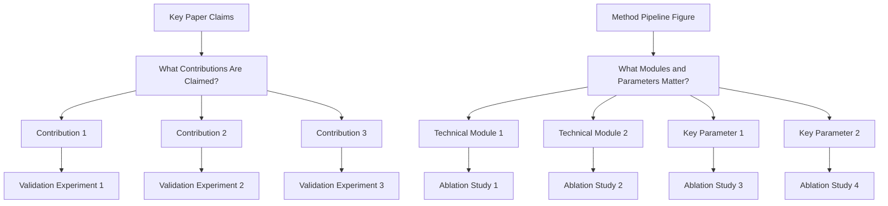
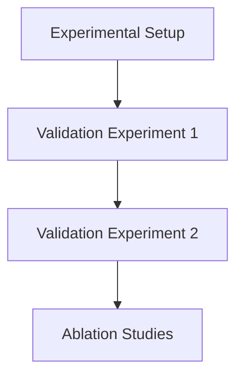

# Experiments Writing Guide

## Goal

Convince reviewers with complete evidence on effectiveness, causality, and practical value.

## Three Core Questions

1. Is the method better than strong baselines?
   - Run comparison experiments against strong and recent baselines.
   - Report standard metrics on the main benchmark(s).
   - Include SOTA or strongest public methods, not only weak baselines.
   - Keep protocol fair (same data split, preprocessing, and evaluation settings).
2. Which modules/design choices make the gain?
   - Run ablation studies for each key module/design choice.
   - Use remove/replace/disable variants and report delta to full model.
   - Include component interaction ablations when modules are coupled.
3. How far can the method generalize under harder settings?
   - Run demos/evaluations on harder or out-of-distribution settings.
   - Add stress-test scenarios (more complex scenes, rarer cases, noisier inputs, or stricter constraints).
   - Report both gains and failure modes to show realistic boundaries.

## Experiment Planning

## Experiment Section Decomposition

## Figure/Table Writing Rules

`Good tables are part of experiment communication quality, not decoration.`

1. Figure captions and table captions are equally important in the writing quality of Experiments.

### Hard rules

1. Put caption above the table.
2. Avoid vertical lines (`|`) in tabular columns.
3. Do not use double rules or dense `\hline` stacks.
4. Use `booktabs` style (`\toprule`, `\midrule`, `\bottomrule`) for clean structure.
5. Use as few horizontal rules as possible; lines should separate groups, not every row.
6. Highlight key numbers (best/second-best or target rows) with subtle color emphasis.

### Readability rules from review practice

1. Label metric direction in column headers (for example `PSNR ↑`, `LPIPS ↓`).
2. Add units when needed so values are interpretable without guessing.
3. Align text columns left; keep numeric columns consistently aligned.
4. Keep numeric precision consistent (same decimal places within a metric column).
5. Group multi-dataset or multi-setting results using `\multicolumn` + `\cmidrule`, not vertical separators.
6. One table, one message: do not mix unrelated results in a single table.
7. If rows represent different attributes/ablations, encode that explicitly in row names or attribute columns.
8. Keep caption focused on setting/protocol/notation, not long discussion.
9. If there is little detail to explain, use one concise sentence to summarize the main result.
10. For single-column figures/tables in two-column papers, prefer placing them in the right column when layout allows, so readers can enter the page from the left-top text without breaking reading flow.

### Minimal LaTeX checklist

1. Add packages in preamble: `\usepackage{booktabs}`, `\usepackage{colortbl,xcolor}` (and optionally `\usepackage{siunitx}` for decimal alignment).
2. Replace `\hline`-heavy style with `\toprule/\midrule/\bottomrule`.
3. Put `\caption{...}` before `\label{...}` and keep caption above.
4. Use restrained highlighting; never color too many cells.

## Recommended Ablation Package

1. One core ablation table for all major contributions.
2. Several focused mini-ablations for module-level design choices.
3. Matching qualitative visual results for each important ablation.

### Six Types of Ablation

1. **Component removal**: Remove one module at a time (most common)
2. **Component replacement**: Replace your novel component with a simpler/standard alternative
3. **Hyperparameter sensitivity**: Vary key hyperparameters to show robustness
4. **Data ablation**: Vary training data size, composition, or augmentation
5. **Architecture ablation**: Change model structure (depth, width, attention type)
6. **Loss function ablation**: Test different loss formulations

## Experimental Setup Writing

### Datasets
- Dataset name, source, version; size; data splits; preprocessing/augmentation; why appropriate
- Use standard benchmarks; cite original dataset paper; report basic statistics

### Evaluation Metrics
- Use standard metrics; multiple complementary metrics; define formally; explain directionality

### Baselines
- Include strong, recent SOTA; classical methods for context; if using published numbers, cite
- **Common mistake:** Only comparing against weak or outdated baselines

### Implementation Details
- Hardware, software, hyperparameters, training duration, random seeds, code availability

## Real Experiment Examples

### SAM (Kirillov et al., TPAMI 2023)

**Structure:**
- 7.1: Zero-Shot Single Point Valid Mask Evaluation (23 datasets, mIoU + human study)
- 7.2: Zero-Shot Edge Detection (BSDS500, ODS/OIS/AP/R50)
- 7.3: Zero-Shot Object Proposals (LVIS v1, AR@1000)
- 7.4: Zero-Shot Instance Segmentation (COCO AP, LVIS AP)
- 7.5: Zero-Shot Text-to-Mask (proof-of-concept)
- 7.6: Ablations (data engine stages, data volume, encoder scaling)

**Key patterns:**
- Each sub-section answers a distinct *capability question*
- Ablation comes last, not first
- Human study supplements automated metrics

### FlashAttention (Dao et al., NeurIPS 2022)

**Structure:**
- Throughput benchmark (A100: 225 TFLOPs/sec, 72% MFU)
- Memory benchmark (10X savings at 2K, 20X at 4K)
- Training speedup (3-5x vs HuggingFace baseline)

**Key patterns:**
- Hardware utilization: "225 TFLOPs/sec per A100, equivalent to 72% model FLOPs utilization"
- Memory savings scale with sequence length: "10X at 2K, 20X at 4K"
- Practical speedup: "3-5x compared to the baseline implementation from Huggingface"

### YOLOv7 (Wang et al., CVPR 2023)

**Structure:**
- Detection on MS COCO (6 model variants, AP + FPS)
- Instance Segmentation (AP_box + AP_mask)
- Anchor-Free Detection (AP_val)

**Key patterns:**
- Speed-accuracy Pareto frontier: 51.4% AP at 161 fps → 56.8% AP at 36 fps
- Multiple model variants: YOLOv7, YOLOv7-X, W6, E6, D6, E6E
- "Trainable bag-of-freebies": training enhancements that don't increase inference cost

### DINO (Zhang et al., ICLR 2023)

**Structure:**
- 12-epoch training (R50: 49.0-49.4 AP)
- 24-epoch training (R50: 50.4-51.3 AP)
- 36-epoch training (R50: 50.9-51.2 AP)
- Swin-L backbone (56.8-58.5 AP)

**Key patterns:**
- Fast convergence: "49.4 AP in 12 epochs"
- SOTA: "63.2 AP on COCO Val with more than ten times smaller model size"
- Training schedule ablation: 12/24/36 epochs

### VAR (Tian et al., NeurIPS 2024 Best Paper)

**Structure:**
- ImageNet Generation (FID, IS, precision, recall)
- Scaling Law Analysis (loss/quality vs. model size/compute)
- Zero-shot Generalization

**Key patterns:**
- First-claim: "GPT-style autoregressive models surpass diffusion models"
- Scaling law discovery: "power-law Scaling Laws in VAR transformers"
- Model scaling: VAR-d16 (310M) → VAR-d30 (2.0B) → VAR-d36 (2.3B)

## Results Discussion Writing

- State key finding first, then give number
- Highlight trends, gaps, and surprises — don't just restate table values
- Explain why your method works better, not just that it does
- Address cases where your method does NOT outperform

## Statistical Rigor

- Report over multiple random seeds (3-5 runs)
- Report mean and standard deviation
- Use significance tests (paired t-test, Wilcoxon) when claiming superiority
- Report p-values or confidence intervals

## Common Mistakes

1. Mixing methods and results
2. No logical flow
3. Missing ablation study
4. Weak baselines
5. Inconsistent evaluation
6. Single-run results (no variance)
7. Cherry-picking seeds/runs/metrics
8. Missing implementation details
9. No statistical significance
10. Overclaiming beyond data support

## Experimental Rigor Checklist

1. Are baselines recent and relevant?
2. Are metrics sufficient and standard for this task?
3. Is ablation tied to every key design claim?
4. Are claims in Abstract/Introduction supported by reported numbers?
5. Are limitations of evaluation scope explicitly stated?

## IEEE Trans Addendum

For IEEE Transactions papers, also load:

- `references/writing/ieee-experiment-playbook.md`
- `references/writing/ieee-visual-playbook.md`

Use them to enforce:

1. article-type-aware experiment packaging;
2. one reviewer question per major table or figure;
3. explicit quality-efficiency pairing when efficiency is part of the claim;
4. robustness or limitation evidence instead of benchmark-only reporting;
5. honest handling of synthetic, generated, or mixed-source data.

## TNNLS/TVT/TIV Specific Patterns

### IEEE TNNLS Experiment Structure

**Standard structure for traffic prediction papers:**
1. Datasets section (with statistics tables)
2. Baselines (7-10 methods)
3. Implementation details (hardware, hyperparameters)
4. Main results table (bold best values)
5. Ablation studies (3-5 variants)
6. Visualization (attention maps, case studies)
7. Computational cost comparison

**Common datasets:**
- Traffic prediction: METR-LA, PEMS-BAY, PEMS04, PEMS08, NYC-Bike, NYC-Taxi
- Trajectory prediction: Argoverse, nuScenes, Waymo Open Motion, ETH/UCY

**Common metrics:**
- Prediction: MAE, RMSE, MAPE, ADE, FDE
- Detection: mAP, NDS, IoU
- Planning: success rate, collision rate, comfort (jerk), efficiency

### IEEE TVT Experiment Structure

**Standard structure for autonomous driving papers:**
1. Simulation environment description (CARLA/SUMO setup)
2. Baseline methods (5-8 methods)
3. Performance metrics (success rate, collision rate, comfort score, efficiency)
4. Convergence curves
5. Ablation study
6. Robustness analysis (different traffic densities, weather conditions)

**Common environments:**
- CARLA: Urban driving simulation
- SUMO: Traffic flow simulation
- HighD: Highway driving data

### IEEE TIV Experiment Structure

**Standard structure for intelligent vehicle papers:**
1. Real-world dataset description (nuScenes, Waymo, Argoverse 2)
2. Metrics (ADE, FDE, mAP, NDS for perception; miss rate, collision rate for planning)
3. Comparison with SOTA (tables with bold/underline formatting)
4. Qualitative results (trajectory plots, BEV visualizations)
5. Failure case analysis
6. Real-time performance (inference time, FPS)

### Traffic Prediction Table Template

| Method | METR-LA MAE↓ | METR-LA RMSE↓ | METR-LA MAPE↓ | PEMS-BAY MAE↓ | PEMS-BAY RMSE↓ | PEMS-BAY MAPE↓ |
|--------|-------------|---------------|---------------|----------------|----------------|----------------|
| DCRNN | 3.17 | 6.45 | 8.69% | 1.74 | 3.97 | 3.64% |
| STGCN | 3.47 | 7.06 | 9.57% | 1.69 | 3.89 | 3.72% |
| GWNet | 2.69 | 5.64 | 7.10% | 1.58 | 3.58 | 3.21% |
| **Ours** | **2.52** | **5.05** | **6.55%** | **1.52** | **3.45** | **3.10%** |

### Trajectory Prediction Table Template

| Method | ADE↓ | FDE↓ | Miss Rate↓ |
|--------|------|------|------------|
| Social-LSTM | 1.09 | 2.35 | 0.52 |
| Social-GAN | 0.87 | 1.98 | 0.45 |
| PGP | 0.72 | 1.62 | 0.38 |
| **Ours** | **0.65** | **1.48** | **0.32** |

### BEV Segmentation Table Template

| Method | mIoU↑ | FPS↑ | Params (M) |
|--------|-------|------|------------|
| BEVFormer | 48.2 | 8.5 | 74.3 |
| BEVDet | 51.0 | 12.3 | 68.1 |
| **RESAR-BEV** | **54.0** | **14.6** | **62.5** |

### 3D Detection Table Template

| Method | NDS↑ | mAP↑ | Latency (ms) |
|--------|------|------|--------------|
| CenterPoint | 67.3 | 60.3 | 85 |
| TransFusion | 70.2 | 65.5 | 92 |
| **Ours** | **72.1** | **68.2** | **78** |

## IEEE TITS 2025 Traffic Prediction Patterns

### Abstract Structure (10 papers analyzed)

**Standard pattern:**
> "[Context] Traffic flow prediction is a critical component of intelligent transportation systems. [Challenge] However, existing methods face challenges in capturing complex spatio-temporal dependencies. [Solution] To address this, we propose [model name], which [core innovation]. [Validation] Experiments on METR-LA, PEMS-BAY, PEMS04, and PEMS08 demonstrate that our method achieves state-of-the-art performance, outperforming baselines by X% in terms of MAE."

**Key features:**
- Always mentions specific datasets (METR-LA, PEMS-BAY, PeMS04, PeMS08)
- Reports specific metrics (MAE, RMSE, MAPE)
- 3-4 contribution points
- Quantitative efficiency improvements highlighted

### Common Datasets (IEEE TITS 2025)

| Dataset | Type | Nodes | Time Period | Interval |
|---------|------|-------|-------------|----------|
| METR-LA | Speed | 207 sensors | 4 months | 5 min |
| PEMS-BAY | Speed | 325 sensors | 6 months | 5 min |
| PeMS04 | Flow | 307 sensors | 2 months | 5 min |
| PeMS08 | Flow | 170 sensors | 2 months | 5 min |
| WH-CN | Flow | Self-collected | Wuhan | 5 min |

### Common Metrics

| Metric | Direction | Description |
|--------|-----------|-------------|
| MAE | ↓ | Mean Absolute Error |
| RMSE | ↓ | Root Mean Squared Error |
| MAPE | ↓ | Mean Absolute Percentage Error |

### Writing Patterns

**Opening patterns:**
- "In the context of rapidly growing city road networks..."
- "Accurate future traffic flow prediction is essential..."
- "Effective traffic prediction is a critical component..."

**Challenge patterns:**
- "Traditional models use a single fixed graph structure"
- "Existing methods face challenges in capturing spatio-temporal information"
- "GCN-based methods rely on preprocessed data, losing critical features"

**Solution patterns:**
- "We propose [model name], which [core innovation]"
- "To address this, we introduce [method name]"
- "Our key insight is that [observation]"

## IEEE TITS 2025 Autonomous Driving Patterns

### Abstract Structure (10 papers analyzed)

**Standard pattern:**
> "[Context] Autonomous driving has attracted significant attention. [Challenge] However, [specific challenge]. [Solution] To address this, we propose [method name]. [Validation] Experiments on [datasets] demonstrate [results]."

**Key features:**
- Emphasis on safety and real-time performance
- Multiple benchmark evaluation
- Module naming with acronyms (RHP, SGCP, DPE, CMD)
- Foundation model adaptation narratives

### Common Datasets (Autonomous Driving)

| Dataset | Task | Description |
|---------|------|-------------|
| nuScenes | BEV/3D | 1000 scenes, multi-modal sensors |
| BDD100K | Detection | 100K images, diverse scenarios |
| Cityscapes | Segmentation | Urban street scenes |
| nuPlan | Planning | Closed-loop simulation |
| highD | Trajectory | Highway driving data |
| SHRP2 | Trajectory | Urban street data |
| JAAD/PIE | Pedestrian | Pedestrian trajectory |

### Common Metrics (Autonomous Driving)

| Task | Metrics |
|------|---------|
| BEV Segmentation | mIoU, FPS |
| 3D Detection | AP, AP50, AP75, NDS |
| Trajectory Prediction | ADE, FDE, minADE, minFDE |
| Planning | Closed-loop scores, collision rate |
| Efficiency | Throughput, latency, parameter count |

### Writing Patterns

**Opening patterns:**
- "The perception system is a critical role of an autonomous driving system..."
- "Accurate human trajectory prediction is one of the most crucial tasks..."
- "Ensuring and improving the safety of autonomous driving systems is crucial..."

**Contribution patterns:**
- "Our contributions are twofold: (1)... (2)..."
- "We propose [module name] that [function]"
- "Extensive tests across GPU, edge, and mobile platforms"

## IEEE TITS 2025 Traffic Prediction Method Categories

### Category 1: Spatio-Temporal Graph Neural Networks (10 papers)

| Paper | Key Innovation | Datasets |
|-------|---------------|----------|
| Spatio-Temporal Graph Diffusion | Diffusion-based graph convolution | METR-LA, PEMS-BAY |
| Adaptive Multi-Resolution GNN | Multi-scale graph pooling | PeMS04, PeMS08, PEMS-BAY |
| Dynamic Graph Transformer | Joint spatial-temporal attention | METR-LA, PEMS-BAY, PeMS04 |
| Graph WaveNet + Temporal Attention | Dilated causal convolution + attention | METR-LA, PEMS-BAY |
| Spatio-Temporal Hypergraph | Higher-order spatial relationships | PeMS04, PeMS08, PeMSD7 |
| Physics-Informed ST-GNN | Traffic flow theory integration | METR-LA, PEMS-BAY, PeMS04 |
| Meta-Learning Adaptive GNN | Distribution shift adaptation | METR-LA, PEMS-BAY, PeMS08 |
| ST Contrastive Learning | Self-supervised pre-training | PeMS04, PeMS08, PEMS-BAY |
| Multi-Scale ST Fusion | Hierarchical temporal fusion | PeMS04, PeMS08, PeMSD7 |
| Uncertainty-Aware ST-GNN | Probabilistic predictions | METR-LA, PEMS-BAY, PeMS04 |

**Common abstract pattern:**
> "Traffic prediction is crucial for ITS. However, existing methods fail to capture [specific limitation]. To address this, we propose [method] that [innovation]. Experiments on [datasets] demonstrate [results]."

### Category 2: Transformer-Based Methods (10 papers)

| Paper | Key Innovation | Datasets |
|-------|---------------|----------|
| STAEformer | Adaptive spatio-temporal embeddings | METR-LA, PEMS-BAY, PeMS04, PeMS08 |
| PDFormer | Propagation delay-aware attention | PEMS04, PEMS08, METR-LA, PEMS-BAY |
| AGSTFormer | Adaptive graph + Transformer | PEMS04, PEMS08, PEMS07, METR-LA |
| STG-Transformer | Unified spatio-temporal attention | METR-LA, PEMS-BAY |
| DSTAGNN | Dynamic spatial-temporal aware GNN | PEMS04, PEMS08, PEMS07 |
| STAE-Net | Efficient self-attention with spatial mask | METR-LA, PEMS-BAY |
| DTANet | Dynamic temporal attention | PEMS04, PEMS08 |
| UrbanGPT | LLM + spatio-temporal encoder | METR-LA, PEMS-BAY, multi-city |
| STDEN | Diffusion-enhanced Transformer | METR-LA, PEMS-BAY, PeMS04, PeMS08 |
| STG-NCDE | Neural CDE + Transformer | METR-LA, PEMS-BAY |

### Category 3: New Methods (Diffusion/LLM/Mamba) (10 papers)

| Paper | Category | Key Innovation |
|-------|----------|---------------|
| ICST-DNET | Diffusion | Interpretable causal spatio-temporal diffusion |
| SpecSTG | Diffusion | Spectral domain diffusion, 3.33x faster |
| LSDM | LLM+Diffusion | LLM-enhanced spatio-temporal diffusion |
| ST-LLM | LLM | Partially frozen attention for traffic |
| xTP-LLM | LLM | Explainable traffic prediction with LLM |
| TPLLM | LLM | CNN+GCN embedding + LoRA fine-tuning |
| LEAF | LLM | LLM as test-time decision maker |
| Strada-LLM | LLM | Graph LLM with distribution adaptation |
| ST-Mamba | Mamba | First Mamba for spatio-temporal traffic |
| GAMMA-Net | Mamba | GAT + multi-axis Mamba interleaved |

**Key trends:**
- LLM + diffusion fusion (LSDM)
- Mamba as Transformer alternative (linear complexity)
- Explainability in diffusion models (ICST-DNET)
- Few-shot/zero-shot learning (LLM methods)
- Multi-modal fusion (text + spatio-temporal data)

## IEEE TITS 2025 Trajectory Prediction Patterns

### 10 Papers Analyzed

| Paper | Key Innovation | Datasets |
|-------|---------------|----------|
| Self-Supervised Transformer | Noise injection for trajectory augmentation | nuScenes, Argoverse |
| Timewise Intentions | Time-varying intent modeling | ETH/UCY, SDD |
| DAAGT | Scene-centric + decision-aware attention | INTERACTION, nuScenes |
| StyleFormer | Driving style-aware prediction | nuScenes, Argoverse |
| Mapless KD | Knowledge distillation for map-free prediction | nuScenes, Argoverse |
| MSES | Multi-scale temporal + egocentric spatial | nuScenes, Argoverse |
| Intention-Aware Diffusion | Intent-guided diffusion for trajectories | nuScenes, Argoverse |
| Diffutory | Future feature + mode association diffusion | nuScenes, Argoverse |
| Continual Learning | Dual knowledge consolidation + pseudo data | nuScenes, Argoverse |
| Social-Pose | Human body pose for trajectory prediction | ETH/UCY, SDD |

### Common Datasets (Trajectory)

| Dataset | Type | Use Frequency |
|---------|------|---------------|
| nuScenes | Vehicle | 8/10 |
| Argoverse (1/2) | Vehicle | 7/10 |
| Waymo Open Motion | Vehicle | 5/10 |
| ETH/UCY | Pedestrian | 2/10 |
| SDD | Pedestrian | 2/10 |
| INTERACTION | Intersection | 1/10 |

### Common Metrics (Trajectory)

| Metric | Full Name | Frequency |
|--------|-----------|-----------|
| ADE | Average Displacement Error | 10/10 |
| FDE | Final Displacement Error | 10/10 |
| minADE | Minimum ADE | 8/10 |
| minFDE | Minimum FDE | 8/10 |
| MR | Miss Rate | 6/10 |

### Key Innovation Trends
- Diffusion models for trajectory generation (3/10)
- Transformer architectures (4/10)
- Intent-aware modeling (4/10)
- Knowledge distillation and continual learning (2/10)

## IEEE TITS 2025 Traffic Control Patterns

### 10 Papers Analyzed

| Paper | Key Innovation | Metrics |
|-------|---------------|---------|
| VF-MAPPO | Vehicle-level fairness as constraint | AWT, fairness |
| MATLIT | Multi-Agent Transformer for global cooperation | AWT reduction 18.51% |
| DCHI | Knowledge sharing among heterogeneous intersections | Travel time -30% |
| GA2-Naive/GA2-Aug | Macro-micro traffic state communication | Traffic flow efficiency |
| GF-VDDQN | Graph forecast-state vector for temporal trends | Vehicle waiting time |
| Driving Style Integration | IDM parameters as state variable | Queue length |
| BCT-APLight | Bayesian Critique-Tune for policy credibility | AWT -12.92% |
| MetaSignal | Meta-learning with Fourier basis | Adaptation speed |
| CoordLight | Decentralized coordination up to 196 intersections | Throughput |
| HGAT-MARL | Heterogeneous graph for diverse traffic objects | Travel time |

### Common Environments (Traffic Control)
- SUMO simulator (most frequent)
- Real-world traffic datasets (2-9 datasets)
- CityFlow
- Synthetic scenarios

### Common Metrics (Traffic Control)
1. Average waiting time (AWT) — most frequent
2. Vehicle queue length
3. Vehicle travel time
4. Throughput
5. Traffic efficiency
6. Fairness measures (max waiting time)

### Key Innovation Trends (2025)
1. **Heterogeneity handling** — diverse intersections, vehicle types, priority levels
2. **Communication/coordination** — GAT-based, attention-based, neighborhood sharing
3. **Scalability** — meta-learning, transfer learning, up to 196 intersections
4. **Fairness** — vehicle-level fairness as constraint, not just reward
5. **State representation** — graph forecast vectors, queue dynamic encoding
6. **Bayesian methods** — policy credibility evaluation

## IEEE TITS 2025 Multi-Modal Fusion Patterns

### 10 Papers Analyzed

| Paper | Modalities | Key Innovation |
|-------|-----------|---------------|
| GraphBEV++ | LiDAR + Camera | Dual-level alignment (local graph + global deformable) |
| RCGDet3D | 4D Radar + Camera | Simple radar feature enhancement beats complex fusion |
| MMF-BEV | Radar + Camera | Deformable attention BEV fusion |
| RadarXFormer | 4D Radar + Camera | Raw radar spectra cross-dimension fusion |
| ModalPatch | Any modality | Plug-and-play for modality drop robustness |
| MambaFusion | LiDAR + Camera | SSM + windowed Transformer fusion |
| WRCFormer | 4D Radar + Camera | Wavelet attention for radar tensor |
| DiffFusion | LiDAR + Camera | Diffusion-based restoration in adverse weather |
| DGFusion | LiDAR + Camera | Dual-guided Point↔Image fusion |
| DDHFusion | LiDAR + Camera | Cross-modal Mamba for BEV+voxel fusion |

### Common Datasets (Multi-Modal)

| Dataset | Modalities | Frequency |
|---------|-----------|-----------|
| nuScenes | LiDAR + Camera | Highest |
| Waymo | LiDAR + Camera | High |
| KITTI | LiDAR + Camera | Medium |
| K-Radar | 4D Radar + Camera | Medium |
| VoD | 4D Radar + Camera | Medium |
| Argoverse2 | LiDAR + Camera | Low |

### Common Metrics (Multi-Modal)

| Metric | Full Name | Usage |
|--------|-----------|-------|
| mAP | mean Average Precision | 3D detection accuracy |
| NDS | nuScenes Detection Score | Comprehensive score |
| IoU | Intersection over Union | Overlap measure |
| FPS | Frames Per Second | Inference speed |
| AR | Average Recall | Recall rate |

### Key Innovation Trends (2025)
1. **BEV feature alignment** — graph matching, deformable attention, diffusion alignment
2. **State space models** — Mamba/SSM for efficient long-sequence modeling
3. **4D radar fusion** — raw spectrum utilization, wavelet transform
4. **Adverse weather robustness** — diffusion restoration, bidirectional adaptive fusion
5. **Modality drop robustness** — plug-and-play modules, historical data prediction
6. **Dual-guided fusion** — Point-guide-Image + Image-guide-Point bidirectional

## IEEE TITS 2025 Demand Prediction Patterns

### 10 Papers Analyzed

| Paper | Domain | Key Innovation |
|-------|--------|---------------|
| TSAGE (HFL) | Ride-hailing | Federated learning + GraphSAGE + GRU |
| TSAGE (VFL) | Ride-hailing | Vertical FL with homomorphic encryption |
| MMDNet | Multimodal | Meta-learning for cross-mode interactions |
| DTW-GAT | Bike-sharing | DTW-based adjacency + temporal attention |
| DT-CTFP | Traffic flow | 6G digital twin + meta-learning transfer |
| ADCSD | Traffic flow | Online test-time adaptation with series decomposition |
| PRMAN | Data imputation | Physics-regularized Swin Transformer |
| GenS2-P | EV charging | Cyberattack-resilient generative self-supervised learning |
| Score-STPP | Accident | Spatial-temporal point process + diffusion |
| AUMS | Bike-sharing | AIoT + dynamic clustering + rebalancing |

### Common Datasets (Demand Prediction)

| Dataset | Domain | Location |
|---------|--------|----------|
| NYC Uber/Lyft | Ride-hailing | New York City |
| Beijing multimodal | Multimodal | Beijing |
| Chicago multimodal | Multimodal | Chicago |
| Bike-sharing station | Bike-sharing | Various cities |
| EV charging logs | EV charging | Various |
| Traffic accident records | Safety | Multiple cities |

### Common Metrics (Demand Prediction)

| Metric | Usage |
|--------|-------|
| MAE | Prediction accuracy |
| RMSE | Prediction accuracy |
| MAPE | Percentage error |
| Utilization rate | Bike-sharing efficiency |
| Trip frequency | Usage intensity |
| Unmet demand rate | Service quality |

### Key Innovation Trends (2025)
1. **Federated learning** — privacy-preserving collaborative prediction (HFL, VFL)
2. **Meta-learning** — cross-domain/cross-city transfer
3. **Physics-informed** — fundamental diagram constraints
4. **Test-time adaptation** — handling temporal drift
5. **Real-world deployment** — 15-month phased validation
6. **Robustness** — cyberattack-resilient forecasting

## IEEE TITS 2025 Federated Learning & Edge Computing Patterns

### 10 Papers Analyzed

| Paper | Domain | Key Innovation |
|-------|--------|---------------|
| FedGau | Autonomous driving | Gaussian-based hierarchical FL |
| UAV-VEC-KD | Edge computing | UAV + knowledge distillation FL |
| PSFL | ITS | Personalized split federated learning |
| FedCPC | 6G ITS | Clustered FL with adaptive pruning |
| CAV-FL | Connected vehicles | Cost optimization + model selection |
| IoV-FL | IoV | Multi-task FL + incentive mechanism |
| V2X-IDS Survey | V2X security | FL + Edge AI for intrusion detection |
| VEC-Offloading | Edge computing | Two-hop vehicle-assisted edge computing |
| ISCC-VCP | Cooperative perception | Integrated sensing-communication-computation |
| MEC-V2X | V2X networks | Mode selection + resource allocation |

### Common Environments (FL/Edge)

| Environment | Usage |
|-------------|-------|
| SUMO | Traffic simulation |
| Cityscapes | Street scene understanding |
| CIFAR-10/100 | FL benchmark datasets |
| Real vehicle networks | Deployment validation |

### Common Metrics (FL/Edge)

| Metric | Usage |
|--------|-------|
| Convergence speed | Training efficiency |
| Communication overhead | Bandwidth cost |
| Model accuracy | Prediction quality |
| Latency/Delay | Real-time performance |
| Energy consumption | Battery life |
| Load balancing | Resource utilization |

### Key Innovation Trends (2025)
1. **Hierarchical FL** — multi-level aggregation for cross-city scenarios
2. **Personalized FL** — split learning + federated learning
3. **Communication efficiency** — pruning, knowledge distillation, adaptive aggregation
4. **Edge intelligence** — task offloading, resource allocation, mode selection
5. **Security** — intrusion detection, adversarial robustness, privacy preservation
6. **Real-world validation** — 15-month deployment, phased rollout
