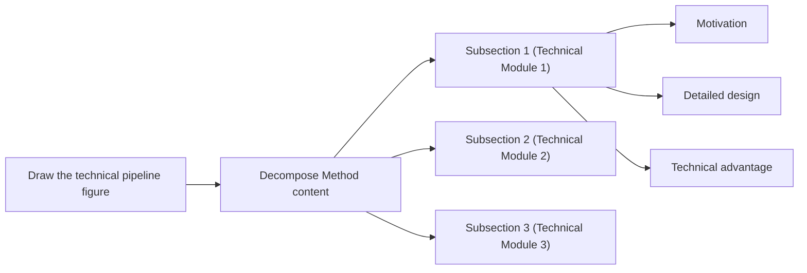
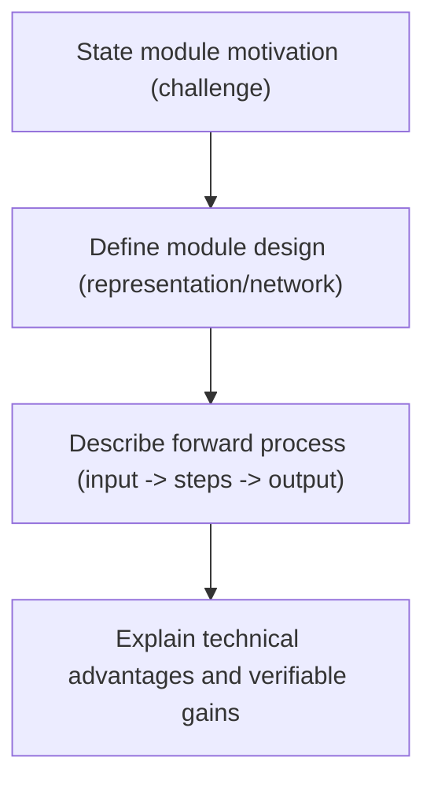

# Method Writing Guide

## Goal

Write the Method section clearly by following this sequence:

1. Answer key method-design questions.
2. Draw a pipeline figure sketch.
3. Write the method section step by step.

## Pre-Writing Questions

`Before writing Method, first answer: (1) what modules exist in the method, and (2) for each module, what is the workflow, why this module is needed, and why this module works.`

Recommended organization:

1. List all modules in the pipeline.
2. For each module, answer three questions:

- How does the module run?
- Why do we need this module?
- Why does this module work?

3. Organize answers as a mind map or a table for clarity.

## Method Writing Steps

`Method writing steps: (1) draw pipeline figure sketch, (2) map subsections from the sketch, (3) plan each subsection with motivation/design/advantages, (4) write module design first, (5) then add motivation and technical advantages.`

Step-by-step workflow:

1. Draw the pipeline figure sketch.
2. Use the sketch to organize Method subsection structure.
3. For each subsection, plan three parts: motivation, module design, and technical advantages.
4. Write module design first to build a concrete backbone.
5. Add motivation and technical advantages afterward.

## Three Elements of a Pipeline Module

`A pipeline module has three elements: Module design, Motivation of this module, and Technical advantages of this module.`

### 1) Module Design

Definition:

1. Describe representation/network/data-structure details.
2. Describe the forward process clearly: given input -> step 1 -> step 2 -> step 3 -> output.

### 2) Motivation of This Module

Definition:

1. Explain why this module is needed.
2. Use problem-driven logic: because problem X exists, we design module Y.

### 3) Technical Advantages of This Module

Definition:

1. Explain why this module has technical advantage over alternatives.
2. Tie advantage to measurable behavior when possible.

### Example of the Three Elements

Local cite:

1. `references/examples/method/example-of-the-three-elements.md`

## Method Content Decomposition



## How to Write Module Design

`Module design usually has two parts: (1) describe specific data/network structures, and (2) describe forward process as input -> steps -> output.`

Writing structure:

1. Define key structures first (representation, network, data structure).
2. Write forward process in strict execution order.
3. End with output interpretation or purpose.

Sentence skeleton:

1. `We represent ... with ...`
2. `Given [input], we first ... then ... finally ...`
3. `This produces [output], which is used for ...`

Local cite:

1. `references/examples/method/module-design-instant-ngp.md`

## How to Write Module Motivation

`Module motivation is usually problem-driven: because a problem exists, we design xx to solve it.`

Typical opening sentences:

1. `A remaining problem/challenge is ...`
2. `However, we ...`
3. `Previous methods have difficulty in ...`

Local cite:

1. `references/examples/method/module-motivation-patterns.md`

## How to Check Whether Method is Easy to Understand

`Check method clarity from three levels: writing logic, paragraph writing, and sentence writing.`

### 1) Logic-level check

1. After finishing the paper, summarize the Method writing logic again.
2. Check whether this summarized logic is smooth and easy to follow.

### 2) Paragraph-level check

1. The first sentence of each paragraph should make readers immediately understand what this paragraph is about.
2. One paragraph should clearly deliver one message.

### 3) Sentence-level check

1. Carefully check whether the **motivation** of each sentence is explicit. Keep one thing clear to readers at all times: **why this sentence content is needed**.
2. Carefully check sentence-to-sentence flow.
3. Carefully check term consistency and avoid changing key terms back and forth.

## Method Section Skeleton

```latex
\section{Method}
% Overview
% Section 3.1
% Section 3.2
% Section 3.3
```

Local cite:

1. `references/examples/method/section-skeleton.md`

## Overview Subsection

`Overview should usually include: setting, core contribution, optional pipeline figure pointer, and a map of what each subsection contains.`

Writing structure:

1. One to two sentences for task setting.
2. One to two sentences for core contribution.
3. If pipeline/framework is novel, point to overview figure.
4. Tell readers what Section 3.1/3.2/3.3 covers.

Local cite:

1. `references/examples/method/overview-template.md`

## Section 3.1 and Other Module Subsections

`Basic subsection logic: (1) motivation of this module, (2) module forward process/module design, (3) technical advantages of this module.`

Local cite:

1. `references/examples/method/example-of-the-three-elements.md`

## Module Writing Pattern (Mermaid)



## Implementation Details

`Implementation details include hyperparameters (e.g., layer count, feature dimensions), coordinate transforms/normalization, and other practical details. Put them near the end of Method or in a dedicated Implementation Details section.`

## Real Method Examples

### ResNet — Problem-Driven Module Design

**Motivation:**
> "When deeper networks are able to start converging, a degradation problem has been exposed: with network depth increasing, accuracy gets saturated and then degrades rapidly."

**Design:**
> "We explicitly let the layers fit a residual mapping F(x) := H(x) − x."

**Advantage:**
> "We evaluate on CIFAR-10... our 152-layer ResNet... achieves 5.71% top-5 error."

**Pattern:** Problem → Design → Measurable advantage

### FlashAttention — Complexity-Driven Motivation

**Motivation:**
> "The standard Transformer self-attention mechanism has time and memory complexity O(N²) in sequence length."

**Design:**
> "We propose FlashAttention, an IO-aware exact attention algorithm that computes exact attention... We reduce memory reads/writes between HBM and SRAM by tiling the softmax computation."

**Advantage:**
> "FlashAttention runs 2-4x faster than standard attention and uses 5-20x less memory."

**Pattern:** Complexity problem → Tiling/recomputation design → Measured speedup

### Mamba — Selective State Space Model

**Motivation:**
> "Transformers are the de-facto standard for sequence modeling but suffer from O(N²) complexity. Prior subquadratic models fall short of Transformers on information-dense data."

**Design:**
> "Mamba introduces selective state spaces that adapt based on input content. The parameters B, C, and Δ are input-dependent."

**Advantage:**
> "Mamba achieves 5x faster inference than Transformers at sequence length 1M."

**Pattern:** Complexity problem → Selective mechanism → Scaling advantage

### LoRA — Parameter-Efficient Fine-Tuning

**Motivation:**
> "Fine-tuning large language models is computationally expensive and memory-intensive."

**Design:**
> "We freeze the pre-trained model weights and inject trainable low-rank matrices: W₀ + ΔW = W₀ + BA, where B ∈ R^{d×r}, A ∈ R^{r×k}, and r << min(d, k)."

**Advantage:**
> "LoRA reduces trainable parameters by 10,000x and GPU memory by 3x, while matching full fine-tuning performance."

**Pattern:** Resource constraint → Mathematical formulation → Quantified efficiency gain

## Traffic Prediction Method Examples

### Graph WaveNet — Adaptive Graph Learning

**Motivation:**
> "Predefined graph structures based on distance or connectivity cannot capture dynamic spatial dependencies in traffic networks."

**Design:**
> "We learn adaptive adjacency matrices through node embeddings: A = softmax(ReLU(E1 · E2^T)), where E1 and E2 are learnable embedding matrices."

**Advantage:**
> "The adaptive graph discovers hidden spatial correlations without relying on predefined road network topology."

**Pattern:** Limitation of fixed graphs → Learnable graph construction → Data-driven spatial discovery

### PDFormer — Propagation Delay Awareness

**Motivation:**
> "Traffic congestion propagates across road networks with inherent delays that existing methods ignore."

**Design:**
> "We design a delay-aware attention mechanism that explicitly models propagation delays. The attention from sensor j to sensor i looks at the state of j at time t − τ_ij."

**Advantage:**
> "By modeling delays explicitly, we achieve 8.7% MAE reduction on long-horizon prediction."

**Pattern:** Physical phenomenon → Mechanism design → Quantified improvement

### STAEformer — Adaptive Embedding

**Motivation:**
> "Traditional fixed positional encodings cannot capture the complex spatio-temporal patterns in traffic data."

**Design:**
> "We propose spatio-temporal adaptive embeddings that learn context-dependent representations for each sensor and time step."

**Advantage:**
> "The adaptive embeddings enable the model to capture dynamic patterns that fixed encodings miss."

**Pattern:** Limitation of fixed representations → Adaptive learning → Dynamic pattern capture

### DiffSTG — Diffusion for Traffic

**Motivation:**
> "Deterministic models fail to capture the inherent uncertainty in traffic forecasting."

**Design:**
> "We apply denoising diffusion probabilistic models on graph-structured traffic data. The forward process adds noise along the graph structure, and the reverse process learns to denoise conditioned on historical observations."

**Advantage:**
> "The diffusion framework provides calibrated uncertainty estimates alongside point predictions."

**Pattern:** Uncertainty modeling → Generative framework → Probabilistic predictions

## IEEE Trans Addendum

For IEEE Transactions papers, add these checks:

### 1. Figure-backed overview

If the paper introduces a nontrivial pipeline, the overview subsection should usually point to a figure that:

- names the real modules,
- matches the section/subsection order,
- and does not introduce components absent from the manuscript.

### 2. Module-to-evidence pairing

For every core module, ask:

1. Where is the motivation written?
2. Where is the mechanism written?
3. Where is the evidence that this module matters?

If a module has no later evidence path, either:

- reduce the claim,
- merge the module into another subsection,
- or add the corresponding ablation/evaluation artifact.

### 3. No fake precision in implementation details

Do not invent:

- hyperparameters,
- training epochs,
- batch sizes,
- hardware,
- runtime,
- memory,
- or parameter counts.

If these details are not confirmed yet, mark them as `needs evidence` in drafting notes or postpone them to a verified implementation-details pass.

### 4. Explanatory figures are not result figures

Method diagrams may simplify computation flow, but must not visually imply measured gains,
quantitative comparisons, or deployment scale unless those facts are already grounded in the paper.

## Example Bank

1. `references/examples/method-examples.md`
2. `references/examples/method/pre-writing-questions.md`
3. `references/examples/method/module-triad-neural-body.md`
4. `references/examples/method/module-design-instant-ngp.md`
5. `references/examples/method/module-motivation-patterns.md`
6. `references/examples/method/section-skeleton.md`
7. `references/examples/method/overview-template.md`
8. `references/examples/method/example-of-the-three-elements.md`
9. `references/examples/method/method-writing-common-issues-note.md`

---

## Anti-AI Patterns for Method Sections (去AI味)

### M1: Generic Module Names
**Bad:** "Feature Extraction Module", "Processing Module", "Output Module"
**Good:** "Deformable Attention Backbone", "Cross-Modal Fusion Layer", "Query-Based Detection Head"
**Rule:** Use specific technical names that describe what the module does.

### M2: Vague Motivation
**Bad:** "This module is important for the overall system."
**Good:** "Existing attention mechanisms require O(n²) memory, limiting application to high-resolution images. We design a linear attention module to address this."
**Rule:** Motivation should be problem-driven with specific technical consequence.

### M3: Missing Forward Process
**Bad:** "The module processes the input and produces the output."
**Good:** "Given input feature map F ∈ R^(H×W×C), we first apply 1×1 convolution to reduce channels to C/4, then compute attention scores A = softmax(QK^T/√d), and finally output O = AV."
**Rule:** Describe the forward process with specific operations and tensor shapes.

### M4: Unsubstantiated Advantages
**Bad:** "Our module is more efficient and effective."
**Good:** "Our module reduces memory from O(n²) to O(n) while maintaining 98% of the attention quality."
**Rule:** Advantages should be tied to measurable behavior.

### M5: Template Section Openings
**Bad:** "In this section, we present our proposed method."
**Good:** "We decompose the pipeline into three modules: tracking, mapping, and planning."
**Rule:** State what the section contains, not that you're presenting it.

### M6: Missing Implementation Details
**Bad:** "We use a standard transformer architecture."
**Good:** "We use a 12-layer transformer with hidden dimension 768, 12 attention heads, and GELU activation."
**Rule:** Include specific hyperparameters and implementation choices.

### Method De-AI Checklist

- [ ] Module names are specific and technical
- [ ] Motivation is problem-driven with specific consequence
- [ ] Forward process is described with operations and tensor shapes
- [ ] Advantages are tied to measurable behavior
- [ ] Section openings state content, not meta-announcements
- [ ] Implementation details include specific hyperparameters
