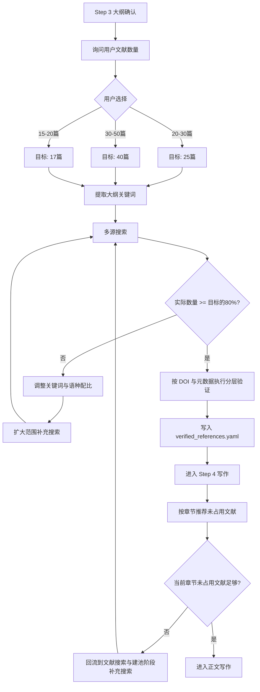

# 参考文献 workflow

> **单独存放，按需生成**

---

## 核心原则

1. **文献池独立存放**：`workspace/references/verified_references.yaml`
2. **文献搜索阶段位于 Step 3 与 Step 4 之间**：它不是独立 Step，而是大纲确认后、正文写作前的必经环节
3. **文献搜索与建池机制可回流复用**：在 Step 4/6/7 发现文献不足、验证失败、语种比例失衡或可用未占用文献不足时，必须回流补池
4. **默认数量 20-30 篇**：适合标准本科论文
5. **允许无 DOI 的真实文献**：文献本身没有 DOI 并不等于假文献
6. **单篇文献整篇论文只能引用一次**：一旦某个 `ref_id` 被正文使用，后续章节不得再次使用

---

## 流程概览



---

## 用户交互

### Step 3 大纲确认后询问文献数量

```json
{
  "questions": [
    {
      "header": "文献数量",
      "question": "大纲已生成，请选择参考文献数量需求：",
      "multiSelect": false,
      "options": [
        {
          "label": "20-30 篇(推荐)",
          "description": "标准本科论文参考文献数量，适合大多数学科。",
          "markdown": "📚 标准本科论文配置\n✅ 适合大多数学科\n⏱️ 搜索时间适中"
        },
        {
          "label": "30-50 篇",
          "description": "文献综述较多或研究深入的论文。",
          "markdown": "📚 研究型论文配置\n✅ 更全面的文献覆盖\n⏱️ 搜索时间较长"
        },
        {
          "label": "15-20 篇",
          "description": "研究范围较小或文献资源有限。",
          "markdown": "📚 轻量配置\n✅ 快速完成\n⏱️ 搜索时间较短"
        }
      ]
    }
  ]
}
```

---

## 文献池格式

`workspace/references/verified_references.yaml`：

```yaml
# 已验证的真实文献池
pool_id: thesis_references
generated_at: 2026-04-13
total: 25

references:
  - id: ref_001
    title: "Retrieval-Augmented Generation for Knowledge-Intensive NLP Tasks"
    authors: ["Lewis P", "Perez E", "Piktus A"]
    year: 2020
    doi: "10.18653/v1/2020.naacl-main.13"
    doi_url: "https://doi.org/10.18653/v1/2020.naacl-main.13"
    verification_status: verified_doi
    verification_reason: "DOI 可达且元数据匹配"
    metadata_verified: true
    doi_reachable: true
    source: "Semantic Scholar"
    source_url: "https://api.semanticscholar.org/..."
    citation_count: 1200
    relevance_score: 0.85
    keywords: ["RAG", "knowledge-intensive", "NLP"]
    gb7714: "[1] Lewis P, Perez E, Piktus A, et al. Retrieval-Augmented Generation for Knowledge-Intensive NLP Tasks[C]//NAACL 2020. 2020. [DOI](https://doi.org/10.18653/v1/2020.naacl-main.13)"
```

---

## 引用规则

| 规则 | 说明 | 违规处理 |
|------|------|----------|
| 只引用已验证文献 | 所有引用必须来自文献池 | 自动标记为「未验证」，触发重生成 |
| 禁止编造标题 | 不能虚构论文标题 | 触发重生成 |
| 禁止编造作者 | 不能虚构作者名 | 触发重生成 |
| 禁止编造 DOI | 不能虚构 DOI 号 | 触发重生成 |
| DOI 优先、元数据兜底 | 文献本身没有 DOI 时，允许用标题/作者/年份匹配验证 | 无法匹配则标记为未验证 |
| **数量严格控制** | 最终参考文献不得超出用户选择的上限 | 合并时按相关度截取 |
| **中英文文献均需包含** | 参考文献中中文和英文文献都必须有 | 缺少任一语种则触发补充搜索 |
| **中文文献占比 >65%** | 中文文献占参考文献总数需严格大于 65% | 自动源不足时必须提示从 CNKI、万方、学校图书馆等人工补充真实中文文献，禁止伪造 |
| **单篇文献只能引用一次** | 同一 `ref_id` 一旦被正文使用即视为已占用 | 当前章节缺少未占用文献时必须回流补池，禁止复用已占用文献 |

### 中英文比例硬约束

> **以 error.md 为准**：中文文献 >65%，英文文献 <35%。
> 此比例在 SKILL.md 中可配置(`zh_ratio` 参数)，默认 0.65。

| 语种 | 占比要求 | 说明 |
|------|---------|------|
| 中文文献 | > 65% | 中文期刊、学位论文 |
| 英文文献 | < 35% | 国际前沿研究 |

**搜索策略**：
1. 先用中文关键词搜索目标×65%数量以上的文献
2. 再用英文关键词搜索目标×35%数量以下的文献
3. 合并后检查比例，不达标触发补充搜索(优先补充中文)
4. 若 Semantic Scholar、CrossRef、OpenAlex 等自动源无法满足中文比例，必须明确提示用户从 CNKI、万方、学校图书馆等外部高质量来源人工补充真实文献；不得为了满足比例生成虚假中文文献

### 数量控制规则

| 用户选择 | 文献池搜索数量 | 最终参考文献上限 | 允许范围 |
|---------|--------------|----------------|---------|
| 20-30 篇 | 搜索 35 篇 | 30 篇 | 15-35 篇 |
| 30-50 篇 | 搜索 55 篇 | 50 篇 | 25-55 篇 |
| 15-20 篇 | 搜索 25 篇 | 20 篇 | 10-25 篇 |

> **截取规则**：如实际引用数量超出上限，按 `relevance_score`(相关度)排序后截取。合并脚本会自动处理。

---

## DOI 与元数据分层验证状态

| 状态 | 含义 | 是否允许继续 |
|------|------|--------------|
| `verified_doi` | DOI 可达且元数据匹配 | 是 |
| `verified_metadata_only` | 文献本身没有 DOI，但标题/作者/年份匹配通过 | 是 |
| `broken_doi_metadata_ok` | DOI 链接不可达，但元数据匹配通过 | 是 |
| `missing_doi_unverified` | 无 DOI 且无法通过元数据验证 | 否 |
| `invalid_reference` | 标题、作者、年份等存在明显错误 | 否 |

### 规则说明

- **文献本身没有 DOI** 在中文学位论文、部分会议资料、内部报告中是常见现象，不应直接视为假文献。
- DOI 链接不存在，可能是 DOI 录入错误、老文献未登记、或出版社迁移导致；因此需要继续看元数据是否能匹配真实来源。
- 只有 `missing_doi_unverified` 与 `invalid_reference` 会在后续合并前形成硬阻断。

---

## 命令速查

```bash
# 搜索并验证文献
python scripts/references/reference_engine.py --query "关键词" --limit 25 --verify-doi -o workspace/references/verified_references.yaml

# 验证单个 DOI
python scripts/references/reference_engine.py --doi "10.xxx/yyy" --verify-doi

# 导出 GB/T 7714 格式
python scripts/references/reference_engine.py --query "关键词" --format gbt7714 -o workspace/references/references_gbt7714.md

# Step 7 合并前执行在线验证与 404 检查
python scripts/references/reference_validator.py workspace/drafts/参考文献.md --validate-online --check-404
```

> **硬约束**：合并前必须执行 `--validate-online --check-404`，存在 404 的文献不能仅凭 DOI 直接判死，必须结合元数据验证状态再决定是否替换。
> **阻断规则**：仅 `missing_doi_unverified` 与 `invalid_reference` 必须在进入 Step 7 后续环节前清零。
