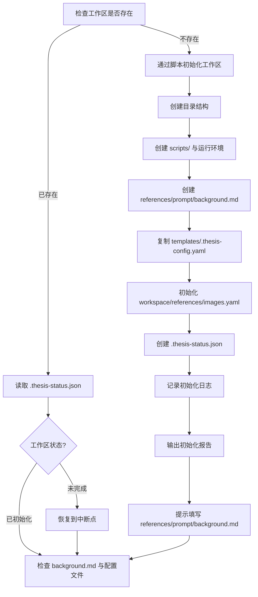

# Step 0: 工作区初始化

> **状态管理(强制执行)**：
> 1. 启动前：`python scripts/status_manager.py thesis-workspace/ --ensure`
> 2. 本步骤启动时执行：`python scripts/status_manager.py thesis-workspace/ --init`
> 3. 完成后执行：`python scripts/status_manager.py thesis-workspace/ --update-step 0 --action complete`
>
> **统一入口(推荐)**：`python scripts/lifecycle.py --workspace thesis-workspace/ --step 0 --event start|complete`

**触发**：
- 「初始化工作区」
- 或首次执行「帮我写论文」时自动触发

---

## 执行流程



---

## 详细步骤

### 1. 检查工作区

- 检查 `<用户项目目录>/thesis-workspace/` 是否存在
- 读取 `.thesis-status.json` 判断当前状态

### 2. 创建工作区(如不存在)

- 工作区不存在时，必须通过脚本初始化工作区，禁止大模型手工拼接目录
- 推荐命令：`python scripts/lifecycle.py --workspace thesis-workspace/ --prepare-runtime`
- 初始化完成后必须执行预检：`python scripts/lifecycle.py --workspace thesis-workspace/ --check-workspace`
- 预检必须覆盖 `scripts/`、`logs/`、`.thesis-status.json`、`.thesis-config.yaml`、`references/prompt/background.md`、`workspace/references/images.yaml`
- 预检必须覆盖运行脚本子模块，例如 `scripts/charts/render.py`、`scripts/charts/source_writer.py`、`scripts/charts/engines/plantuml.py`、`scripts/charts/engines/graphviz.py`、`scripts/references/reference_engine.py`、`scripts/aigc/detect.py`
- 自动创建完整目录结构，包括 `workspace/drafts`、`workspace/final`、`workspace/final/images`、`workspace/final/images/sources`、`workspace/reports`、`workspace/references`
- 自动创建 `scripts/` 目录、运行环境与完整运行脚本模块
- 自动生成 `README.md` 使用说明
- 自动创建 `logs/` 目录
- 复制模板文件：
  - `references/prompt/background_template.md` → `references/prompt/background.md`
  - `references/templates/.thesis-config.yaml` → `.thesis-config.yaml`
- 初始化 `workspace/references/images.yaml`（结构化图片需求清单）
- 初始化 `.thesis-status.json`

### 3. 记录日志

- 创建日志目录：`logs/YYYYMMDD_HHMMSS/`
- 写入 `step_0_init.log`：记录初始化详情
- 更新 `logs/latest` 软链接

### 4. 输出初始化报告

```
✅ 工作区初始化完成！

📂 工作区位置：thesis-workspace/
📝 日志目录：thesis-workspace/logs/latest/

📋 请先完成以下准备：

1. 打开 thesis-workspace/README.md 阅读详细说明
2. 将学校模板放入 references/templates/
3. 将优秀范文放入 references/examples/
4. 将写作规范放入 references/guidelines/
5. 填写 references/prompt/background.md（必填）
6. 将参考文献放入 references/reference/doc/
7. 确认 `thesis-workspace/.thesis-config.yaml` 已生成，并按学校要求修改
8. 确认 `thesis-workspace/workspace/references/images.yaml` 已生成
9. 确认 `thesis-workspace/scripts/charts/render.py` 等脚本子模块已生成
10. 确认 `thesis-workspace/workspace/final/images/sources`、`workspace/drafts`、`workspace/reports` 已生成

⏸️ 请先填写 references/prompt/background.md，再回复「继续」开始论文创作。
```

### 5. 等待用户确认

- 用户回复「继续」后，先检查 `thesis-workspace/references/prompt/background.md`
- 校验规则(全部通过才可继续)：
  - 文件存在
  - 文件大小 > 100 字节
  - 不包含模板占位内容(如 `请填写以下信息`、`(描述研究领域的现状和问题)`)
- 若不通过：
  - 自动创建 `thesis-workspace/references/prompt/background.md`(来源：`references/prompt/background_template.md`)
  - 明确提示用户填写 references/prompt/background.md 后再次回复「继续」
  - **禁止在控制台进行交互式输入采集背景信息**
- 通过后输出文件检查报告并继续后续流程

---

## 防呆机制

- 目录已存在 → 询问是否重置
- 文件已存在 → 保留用户版本，不覆盖

---

## 状态记录

`.thesis-status.json` 格式：

```json
{
  "version": "2.0",
  "created_at": "2026-03-06T15:00:00",
  "updated_at": "2026-03-06T15:00:00",
  "current_step": 0,
  "steps": {
    "0": {"name": "初始化", "status": "completed"}
  },
  "chapter_status": {},
  "references_status": {
    "pool_created": false,
    "pool_path": "",
    "total_refs": 0,
    "zh_ratio": 0.0
  }
}
```
