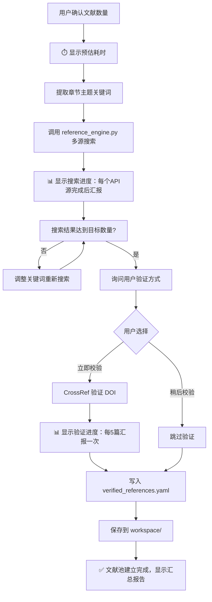

# Step 4: 分章节撰写

> **状态管理(强制执行)**：
> 1. 启动前：`python scripts/status_manager.py thesis-workspace/ --ensure`
> 2. 启动时：`python scripts/status_manager.py thesis-workspace/ --check-step 4`
> 3. 前置条件通过后：`--update-step 4 --action start`
> 4. 每章完成后：`--mark-done chapter_N --words 字数`
> 5. 全部完成后：`--update-step 4 --action complete`
>
> **统一入口(推荐)**：`python scripts/lifecycle.py --workspace thesis-workspace/ --step 4 --event start|complete`

> **⚠️ 强制前置：文献搜索验证**
> 在开始写作前，必须先搜索真实文献建立"文献池"，AI 只能从池中引用，禁止编造。

---

## 4.0 摘要与关键词生成(所有章节完成后执行)

> **执行时机**：所有正文章节(第1-6章)写完之后、Step 5 降重之前生成摘要，确保摘要内容与正文一致。

### 生成规则

| 项目 | 要求 |
|------|------|
| 中文摘要 | **逻辑三段覆盖，中文摘要控制在 550 字左右（建议 500-600 字）**(硬约束) |
| 英文摘要 | 与中文摘要对应，学术英语风格，250-350 词 |
| 中文关键词 | 3-5 个，分号分隔，反映论文核心主题 |
| 英文关键词 | 与中文关键词对应，分号分隔 |

### 摘要三段逻辑写法(硬约束)

> **必须覆盖三段逻辑结构，不强制自然段数必须等于3；中文篇幅建议约占当前页面2/3。**

**第一部分：背景和本文目标**
- 说明研究问题领域、现实需求和本文的研究目标
- 篇幅约占摘要的三分之一

**第二部分：主要内容和技术路线**
- 描述本文的核心内容、采用的技术方案和实现路线
- 篇幅约占摘要的三分之一

**第三部分：主要功能模块、成果和意义**
- 概括系统核心功能模块、最终成果及其应用价值与意义
- 篇幅约占摘要的三分之一

**禁止出现**：引用标记、图表编号、第一人称(我/我们)

### 输出文件

- `workspace/drafts/摘要.md` - 包含中英文摘要和关键词

### 摘要文件格式

```markdown
# 摘要

第一段：背景和本文目标。(约1/3篇幅)

第二段：主要内容和技术路线。(约1/3篇幅)

第三段：主要功能模块、成果和意义。(约1/3篇幅)

**关键词**：关键词1；关键词2；关键词3；关键词4；关键词5

---

# Abstract

Paragraph 1: Background and research objectives.

Paragraph 2: Main content and technical approach.

Paragraph 3: Key functional modules, results and significance.

**Keywords**: keyword1; keyword2; keyword3; keyword4; keyword5
```


## 4.0.2 致谢生成(所有章节完成后执行)

> **执行时机**：与摘要同步，在所有正文章节(第1-6章)写完后执行，Step 5 之前完成。

### 生成规则

| 项目 | 要求 |
|------|------|
| 字数 | 300-800 字 |
| 风格 | 真诚朴实，避免模板化套话 |
| 内容顺序 | 感谢导师 → 感谢同学/团队 → 感谢家人 → 感谢学校/平台 |
| 禁止 | 「首先/其次/最后」等模板词、空泛套话 |

### 输出文件

- `workspace/drafts/致谢.md`

### 致谢模板

```markdown
# 致谢

(感谢导师指导，约100-200字)

(感谢同学或项目团队帮助，约50-150字)

(感谢家人支持，约50-150字)

(感谢学校、实验室或平台支持，约50-150字)
```

---

### 摘要与致谢的章节特化规则(硬约束)

- **摘要**：只允许轻量去模板化处理，重点是删套话、轻度句长波动、压缩冗余表达；禁止设问句、强主观表达和大幅结构重组。
- **致谢**：重点是真诚自然，压缩客套空话即可；禁止技术化表达、机械排比和激进去 AI 手法。
- **总结与展望**：若在写作阶段提前生成结论草稿，应保持结论克制，保留局限与后续工作，不要为追求表达变化强行加入花哨表达。

### 正文章节的章节特化规则(建议执行)

- **绪论/文献综述**：优先删模板词，保持综述体和引用规范，重点文献可详写，次要文献可略写。
- **技术基础/关键技术**：优先写清机制和术语关系，不要把技术描述改成百科式空话或成语化表达。
- **系统设计**：优先补模块名、分层关系、表名、字段或实体关系说明。
- **系统实现**：优先补接口路径、调用链、关键实现步骤和代码关联。
- **系统测试/实验分析**：优先写清测试环境、实验条件、数据指标和结果解释。

> **回退意识**：写作阶段就应按章节差异控制语气和细节密度，避免后续 Step 6 因表达质量问题被迫整章返工。

---

### 系统设计章节图片规则(硬约束)

| 图片 | 来源 | 推荐 engine | 占位符标记 |
|------|------|-------------|------------|
| 系统整体架构图 | **用户自行生成；如需 AI 生成请使用 GPT image 生图后补入** | `user` | `[image_N]` |
| 功能模块图 | **用户手动提供** | `user` | `[image_N]` |
| 各模块业务流程图 | **AI(大模型)生成** | `plantuml` | `[image_N]` |
| 实体 E-R 图(每表一张) | **AI(大模型)生成** | `graphviz` | `[image_N]` |
| 用例图/时序图/类图/活动图 | **AI(大模型)生成** | `plantuml` | `[image_N]` |

### 图片需求清单

- 正文只保留 `[image_N]` 和配套 `image-requirement` 注释块。
- 正文统一使用 `[image_N]` 占位符。
- 每个占位符后必须紧跟 `image-requirement` 注释块，图片说明写入 `workspace/references/images.yaml`；Step 8 会用 `scripts/charts/manifest_builder.py` 抽取并生成清单。
- 正文不得写 `.dot/.mmd/.puml` 图表源码；图表源码只能在 Step 8 写入 `workspace/final/images/sources/`。
- 禁止把图片描述当作正文图片内容，图片要求必须写在 `image-requirement` 注释块中。
- `source=ai`：表示后续由大模型生成图表源码，再由 Step 8 渲染图片。
- `source=user`：表示后续由用户补充真实图片文件，AI 不得伪造截图。
- `diagram_type`：必须标明 `architecture / module / flowchart / er / sequence / usecase / class / activity / screenshot` 等类型。
- `engine` 可省略，由 Step 8 自动推断：ER 图默认 `graphviz`，UML 图默认 `plantuml`，普通图默认 `mermaid`，用户图片默认 `user`。
- `fact_source`：必须标明图片事实来源；ER 图固定优先取 `thesis-workspace/references/prompt/background.md`。
- `prompt_hint`：可选，用于告诉大模型如何生成源码，禁止使用默认模板。
- **Step 4 只负责记录图片需求**，不负责最终生成图片。

正文中的图片需求示例：

```markdown
如图4-1所示，系统整体架构用于说明系统的分层关系与核心组件协作。

[image_1]
<!-- image-requirement
id: image_1
title: 图4-1 系统整体架构图
chapter: 第4章
section: "4.1"
source: user
diagram_type: architecture
purpose: 展示系统整体分层与核心组件关系
fact_source: 用户自行生成；如需 AI 生成请使用 GPT image
placement: 图前先写架构设计目标，图后写分层说明
status: pending_user
description: 系统架构图由用户自行生成后补入
prompt_hint: 架构图不进入自动源码生成和渲染链路
-->
```

---

## 4.1 两阶段写作法(强制执行)

> **目标**：禁止直接一次性生成整章正文，必须先规划、再确认、后扩写。

### Stage 1：章节要点规划

每章开始时，先输出以下内容，**不得直接扩写为完整正文**：

1. 本章目标与拟解决的问题
2. 章节小节对应的核心论点
3. 计划使用的图表/截图/代码片段
4. 计划引用的文献主题与候选 `ref_id`
5. 预计字数分配与段落结构

### Stage 2：用户确认后扩写

仅当用户明确确认要点，或在 **当前章节已经完成 Stage 1** 的前提下回复「继续」，才允许扩写为完整正文。

> **继续规则**：
> - 如果当前停留在 Stage 1，用户回复「继续」仅视为“确认本章要点”，随后进入 Stage 2。
> - 如果 `background.md` 校验、文献数量选择、文献池建立等更早门禁尚未完成，则**不得**因为一句「继续」而跳过。

### 每章推荐执行顺序

```text
Stage 1 要点规划
  → 用户确认
  → 从文献池推荐候选引用
  → Stage 2 扩写正文
  → 执行本章防错检查
  → 标记 chapter_N 完成
```

---

## 4.2 前置文献搜索流程(强制执行)

### 用户交互：询问文献数量

```json
{
  "questions": [
    {
      "header": "文献数量",
      "question": "请选择参考文献数量需求：",
      "multiSelect": false,
      "options": [
        {
          "label": "20-30 篇(推荐)",
          "description": "标准本科论文参考文献数量，适合大多数情况。",
          "markdown": "📚 标准本科论文配置\n✅ 适合大多数学科\n⏱️ 搜索时间适中"
        },
        {
          "label": "30-50 篇",
          "description": "文献综述较多或研究深入的论文。",
          "markdown": "📚 研究型论文配置\n✅ 更全面的文献覆盖\n⏱️ 搜索时间较长"
        },
        {
          "label": "15-20 篇",
          "description": "研究范围较小或文献资源有限。",
          "markdown": "📚 轻量配置\n✅ 快速完成\n⏱️ 搜索时间较短"
        }
      ]
    }
  ]
}
```

### 搜索与验证流程



### 耗时预估提示(搜索前必须显示)

在开始搜索前，向用户显示以下预估信息：

```
📚 文献搜索即将开始！

⏱️ 预估耗时：
   - 搜索阶段：约 2-5 分钟(3个API源并行查询)
   - DOI验证阶段：约 3-8 分钟(逐条验证，每条约3-5秒)
   - 总计预估：5-13 分钟

📋 搜索计划：
   - 目标数量：30 篇
   - 搜索源：Semantic Scholar + CrossRef + OpenAlex
   - 是否DOI验证：是

⏳ 请耐心等待，搜索完成后会自动汇报结果...
```

### 搜索进度汇报(搜索中实时显示)

```
[搜索进度] Semantic Scholar: ✅ 完成 (12条结果)
[搜索进度] CrossRef: ✅ 完成 (8条结果)
[搜索进度] OpenAlex: 🔍 搜索中...
[搜索进度] OpenAlex: ✅ 完成 (15条结果)
[搜索进度] 去重合并: 35 → 28 条

[DOI验证] 验证进度: 5/28 (约还需 2 分钟)
[DOI验证] 验证进度: 10/28 (约还需 1.5 分钟)
[DOI验证] 验证进度: 15/28 (约还需 1 分钟)
[DOI验证] 验证进度: 20/28 (约还需 30 秒)
[DOI验证] 验证进度: 28/28 ✅

✅ 文献池建立完成！
   - 总计搜索到：35 条
   - 去重后保留：28 条
   - DOI验证通过：22 条
   - 已保存到：workspace/references/verified_references.yaml
```

### 执行命令

```bash
# 用户选择「20-30 篇」时执行：
python scripts/references/reference_engine.py --query "章节主题关键词" --limit 30 --format yaml -o workspace/references/verified_references.yaml --verify-doi

# 用户选择「稍后校验」时执行：
python scripts/references/reference_engine.py --query "章节主题关键词" --limit 30 --format yaml -o workspace/references/verified_references.yaml --no-verify
```

---

## 4.3 写作规则

### 必须加载的 Prompt 文件

| 文件 | 说明 | 加载时机 |
|------|------|----------|
| `prompts/writer_guidelines.md` | 写作规范(两阶段写作法) | 写作前 |
| `prompts/aigc_reducer_prompt.md` | AIGC 降重核心策略 | 写作前 |
| `prompts/reference_citation_prompt.md` | 引用生成铁律 | 写作前 |
| `prompts/reference_format_gbt7714.md` | GB/T 7714 格式规范 | 写作前 |
| `workspace/references/verified_references.yaml` | 已验证的文献池 | **必须加载** |

### 写作规范

> **⚠️ 流程记录铁律**：
> - 状态变更必须通过 `status_manager.py` 或 `lifecycle.py` 脚本执行
> - 日志记录必须通过 `logger.py` 脚本输出
> - **禁止大模型自行生成流程记录或日志内容**

- 每段 150-300 字，包含论点+论据+小结
- 每千字至少 2 个文献引用(GB/T 7714-2015)
- **引用必须来自文献池**，禁止自行编造
- **每条引用必须包含 DOI 链接**
- 代码片段不超过 20 行，需有设计说明、中文解释和效果分析
- 使用图表占位符标记图表位置

### IEEE Trans 非编造证据门禁

当当前模式为 `ieee_trans` 时，在 Stage 2 扩写前先做一次证据门禁检查。

硬规则：

1. 未经证据支持，不得写入具体实验数字。
2. 未经证据支持，不得写入具体数据集规模、样本数、设备数、被试数、PR/merge 数、速度提升、显存、参数量、存储降幅。
3. 如果数据来自文献而非本文实验，必须明确写成“文献报告”或“已有工作表明”，不能伪装成本文结果。
4. 如果数据是 `synthetic / generated / augmented / mixed`，必须显式标注来源属性。

### Stage 2 扩写前的证据检查动作

对当前章节草案逐项检查：

1. 有没有具体数字？
2. 每个数字是否能追溯到：
   - `verified_references.yaml`
   - 用户提供的实验记录
   - 工作区中真实存在的结果文件或日志
3. 如果不能追溯：
   - 改写为不含伪精确数字的安全表达；
   - 或在 claim-evidence map 中标成 `needs evidence`；
   - 不允许直接保留。

### 安全改写示例

把：

- `在20个真实应用上提升了...`

改成：

- `在一组真实应用上进行了评估，具体规模见实验设置。`

把：

- `实验表明显存降低了43.2%`

改成：

- `实验将同时报告显存开销，当前数值待结果确认。`

### 写作前文献推荐动作(规定动作)

在 Stage 1 完成后、Stage 2 扩写前，先基于本章关键词从文献池推荐候选文献，再决定正文中的临时引用编号。默认只能从**未占用文献**中选择；如果当前章节可用未占用文献不足，必须回流到 Step 3→4 之间的文献搜索与建池阶段补充文献，禁止复用已占用 `ref_id`。

```bash
# 示例：按章节关键词推荐候选文献
python scripts/references/verified_reference_pool.py --recommend --keywords "章节关键词1 章节关键词2" --limit 5
```

> **执行要求**：优先从 `verified_reference_pool.py` 的推荐结果中选择候选 `ref_id`，再写入正文临时引用；禁止跳过推荐步骤后凭空编造引用。

### 引用编号规则(重要)

> **引用编号统一管理，最终合并到一个 MD 文件**

1. **写作阶段**：各章节初稿中使用**临时编号**(如 `[ref_001]`、`[ref_012]`)，对应 `verified_references.yaml` 中的 `id` 字段
2. **单篇文献整篇仅允许引用一次**：某个 `ref_id` 一旦在任一章节正文中使用，就必须标记为已占用，其他章节不得再次使用；若文献不足，必须回流补池
3. **禁止章节内自建参考文献列表**：各章节 MD 文件中**不单独列出参考文献**，仅在正文中标记临时编号
4. **合并阶段统一处理**：Step 7 合并时，由 `merge_drafts.py` 脚本自动完成：
   - 收集所有章节中引用的临时编号
   - 按正文出现顺序重新编号为 `[1]`, `[2]`, `[3]`...
   - 从 `verified_references.yaml` 生成完整的参考文献列表
   - 输出独立的 `workspace/drafts/参考文献.md` 文件

**章节初稿示例**：

```markdown
## 1.1 研究背景

随着深度学习技术的快速发展[ref_003]，自然语言处理领域取得了突破性进展。Lewis等人提出的RAG方法[ref_001]有效解决了知识密集型任务的挑战。
```

**最终合并后示例**：

```markdown
## 1.1 研究背景

随着深度学习技术的快速发展[1]，自然语言处理领域取得了突破性进展。Lewis等人提出的RAG方法[2]有效解决了知识密集型任务的挑战。

## 参考文献

[1] Brown T, Mann B, Ryder N, et al. Language Models are Few-Shot Learners[J]. NeurIPS, 2020, 33: 1877-1901. [DOI](https://doi.org/10.5555/3495724.3495883)

[2] Lewis P, Perez E, Piktus A, et al. Retrieval-Augmented Generation for Knowledge-Intensive NLP Tasks[C]//NAACL 2020. 2020. [DOI](https://doi.org/10.18653/v1/2020.naacl-main.13)
```

---

## 防错检查(每章完成后)

| 检查项 | 要求 | 不达标处理 |
|--------|------|-----------|
| 图片密度 | 第3-5章每章 ≥3 张图 | 补充占位符 |
| 图文顺序 | 文字→图表→代码 | 调整排版 |
| 图表说明 | 每张图下方 ≥50 字说明 | 补充 |
| 图名位置 | 图名在图的下方，格式 `图X-X  名称` | 修正 |
| 表名位置 | 表名在表的上方，格式 `表X.X  名称` | 修正 |
| 编号格式 | 图用短横线(X-X)、表用句点(X.X) | 修正 |
| 引导语/分析语 | 图表前「如图X-X所示」+ 图表后「从图X-X可以看出」 | 补充 |
| 模块→流程顺序 | 先模块划分后流程描述(第3-5章) | 重组 |
| 截图+代码组合 | 第5章每功能含截图+代码 | 补充 |
| 测试用例 | 第6章 ≥8 条 | 补充 |
| 摘要字数 | 建议页面约2/3，覆盖三段逻辑 | 精简或重写 |
| 代码长度 | ≤20 行，且需设计说明+效果分析 | 拆分或精简 |
| **引用来自文献池** | 所有引用必须在 verified_references.yaml 中 | **触发重生成** |
| **单句多引用** | 每句话最多 1 篇引用，禁止 `[1,3]` / `[1-3]` / `[1][2]` | **拆分为多句，每句引用一篇** |
| **数据库表数量不足** | **严重** | **检查 background.md 中的表定义，第4章必须包含 ≥11 张表结构** |
| **E-R图非实体图** | **严重** | **4.4.1节每个数据库表必须有独立的实体E-R图(非关联图)，配文字描述** |
| **E-R图与表结构混排** | **中等** | **E-R图(4.4.1) 和 表结构(4.4.2) 必须分开两节** |
| **第4章图文比例失衡** | 第4章每张图前后各 100-200 字说明，且每页文字占比 ≥40% | **补充图前/图后说明并调整排版** |
| **第4章图表数量不足** | 第4章图表总数应 ≥15(含实体E-R图≥11张 + 流程图≥3张 + 架构图1张) | **补充图表占位与对应说明** |
| **引用密度不足** | 每章完成后检查引用数量，不足则从文献池补充 | **补充引用后再进入下一章** |
| **DOI 链接完整** | 每条引用含 [DOI](https://doi.org/xxx) | 自动补充或标记 |
| **禁止章节内建参考文献** | 章节内不得出现「## 参考文献」标题 | **删除章节内参考文献，合并阶段统一处理** |

---

## 输出文件

- `workspace/drafts/chapter_N.md` - 各章节初稿(仅含临时引用编号，无参考文献列表)
- `workspace/references/verified_references.yaml` - 文献池(独立存放)
- `workspace/cited_references.json` - 引用记录(每章引用了哪些 ref_id，合并时使用)
