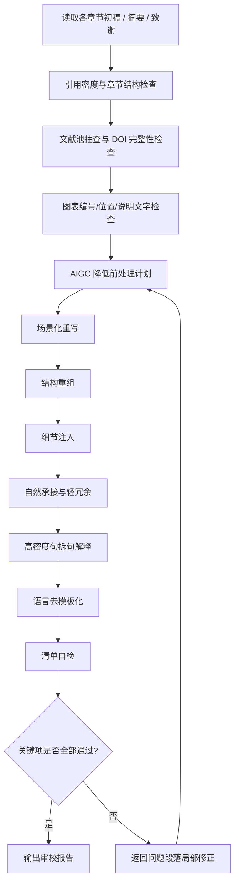

# Step 6: 审校润色

> **状态管理(强制执行)**：
> 1. 启动前：`python scripts/status_manager.py thesis-workspace/ --ensure`
> 2. 启动时：`python scripts/status_manager.py thesis-workspace/ --check-step 6`
> 3. 前置条件通过后：`--update-step 6 --action start`
> 4. 完成后：`--update-step 6 --action complete`
>
> **统一入口(推荐)**：`python scripts/lifecycle.py --workspace thesis-workspace/ --step 6 --event start|complete`

> **目标**：在 Step 7 合并前完成引用、图表、语言风格和表达质量的集中审校，提前发现需要回退修改的问题。

---

## 6.1 本轮执行边界

> **说明**：本轮采用“文档 + 轻脚本”方案。
>
> - Step 6 **定义完整检查链**，并给出建议命令。
> - Step 6 **不会**在 `lifecycle.py` 中实现强阻断状态机。
> - 若检查不通过，必须人工回退到 Step 5 或 Step 4 局部重写后再复检。

---

## 6.2 审校流程



> [!IMPORTANT]
> 处理 AIGC 降低请求时，必须按“处理前计划 → 场景化重写 → 结构重组 → 细节注入 → 自然承接与轻冗余 → 高密度句拆句解释 → 语言去模板化 → 清单自检”的顺序执行。禁止只做同义替换，也禁止只输出改写文本而不输出自检表。

---

## 6.3 必查项

| 检查项 | 目标 | 建议工具/命令 | 不通过处理 |
|--------|------|---------------|-----------|
| 引用密度检查 | 每千字至少 2 条引用，且引用来自文献池 | 人工核对 + `format_checker.py` 辅助 | 补充引用后重查 |
| 文献池 DOI 完整性抽查 | 章节中拟引用文献应来自 `verified_references.yaml`，且 DOI 字段完整 | 人工抽查 `verified_references.yaml` + `verified_reference_pool.py` 推荐结果 | 替换文献或回退 Step 4/5 |
| 图表编号与位置 | 图名/表名/图文顺序符合规范 | 人工核对章节内容 | 调整排版与说明文字 |
| 模板词与句长波动 | 降低模板化表达，避免句式过于均匀 | `scripts/aigc/detect.py` + 人工改写 | 回退 Step 5 局部深改 |
| 改写后自测清单 | 确认长短句交织、模板词清理、自然承接、轻冗余、高密度句拆解、八股文结构祛除、场景化与细节注入均已处理 | `scripts/aigc/detect.py --input ... --format table` + 人工确认 | 任一关键项未通过时回退 Step 5 局部改写 |
| 场景化重写流程 | 将 AIGC 降低流程固定为“场景化重写 → 结构重组 → 细节注入 → 自然承接与轻冗余 → 高密度句拆句解释 → 语言去模板化” | `prompts/aigc_reducer_prompt.md` 第十一节 + 人工审校 | 禁止只做机械同义替换；信息不足时提示补充真实细节 |
| 表达质量复查 | 识别机械同义替换、术语漂移、表达生硬、过度压缩和解释层缺失问题 | `scripts/aigc/detect.py` + 人工审校 | 未通过时局部修正，不得整章重写 |
| 条款保留检查 | 原文存在（1）（2）（3）（4）等条款时，改写后必须保留编号、标题和顺序 | `reduce_workflow.py` 量化报告 + 人工核对 | 缺失条款时回退局部修正，禁止交付 |
| AIGC 量化对比报告 | 输出改写前后整体分数、句长波动、词汇多样性、过渡词、结构模式和高风险段落变化 | `scripts/reduce_workflow.py` 输出的 `AIGC降低量化对比_*.md` | 报告缺失时补跑流程或人工补齐 |
| 处理计划与完成自检 | AIGC 降低前应有处理计划，处理后应有自检表 | 审核 Prompt + `workspace/reports/` 报告 | 任一缺失时不得视为 Step 6 完成 |
| 低可预测表达复查 | 减少模板化转接词，避免沿用原句骨架；允许语义接近前提下重构句子、补自然承接语和轻冗余词 | `scripts/aigc/detect.py` + 人工审校 | 若仍呈模板化结构，回退 Step 5 局部重构 |
| 高信息密度句拆解 | 对职责、动作、目标过度集中在一句内的句子，按“抽主干 → 拆动作 → 补解释层”处理 | `prompts/aigc_reducer_prompt.md` + 人工审校 | 若解释层缺失或过度口语化，回退局部修正 |
| 成语适度使用检查 | 非技术性说明可少量使用贴合语境的成语，技术细节附近不得堆砌 | 人工审校 + `prompts/humanizer_guidelines.md` | 成语突兀或过密时局部删改 |

---

## 6.3.1 表达质量问题优先原则(强制)

1. 运行 `scripts/aigc/detect.py` 后，可参考 `high_risk_paragraphs` 结果定位模板化、句式均匀或表达生硬的段落。
2. 执行 AIGC 率降低时，必须默认采用 `prompts/aigc_reducer_prompt.md` 第十一节的“AIGC 率降低标准流程”，先做场景化重写和结构重组，再做词句层面的去模板化。
3. Step 6 的首选动作是**局部修正表达质量问题段落**，而不是整章重写。
4. 若问题段落集中在摘要、总结与展望、致谢，仍应采用保守修正：优先删模板词和调整句式，禁止激进改写。
5. 系统设计、系统实现、系统测试等正文技术章节，优先核对模块名、接口路径、实验条件、数据指标等作者专属细节是否准确。
6. 若一次局部修正后表达已自然通顺，应停止继续扩写，避免学术表达被过度稀释。
7. 对条款式文本进行 AIGC 降低时，必须保留原条款编号、标题和顺序；用户指定单条 100% 疑似时，优先只处理该条。
8. 每轮处理前需要形成简短计划，处理后必须完成自检；若自检显示条款缺失、语义改变或新增技术点，应继续局部修正。
9. 改写前后需形成量化对比报告，报告结果只作为辅助依据，不替代人工审校。
10. 针对检测仍偏高的功能说明段，应减少“因此、此外、从而、综上所述”等模板化转接词；需要转场时，优先使用“具体来说、换句话说、放到实际使用里看、对应到系统运行过程”等自然承接语，并确保承接后有具体职责、流程或结果说明。
11. 允许在语义接近的前提下重构句子和段内组织，不应沿用原文句式骨架做机械替换。
12. 对信息密度高的句子，应按“抽主干 → 拆动作 → 补解释层”处理，尤其是系统角色、功能职责、设计原因和测试结论类句子。
13. 可保留少量“通常、往往、也会、在一定程度上”等轻冗余词，让句子不至于过度压缩；但不得保留“具有重要意义、发挥重要作用、提升用户体验”等空泛套话。
14. 成语可以适度使用，优先用于非技术性总结、维护边界或效果说明；接口、参数、数据和测试结果附近不得堆砌成语。

## 6.3.2 AIGC 降低单段输出格式(强制)

当用户直接要求“降低这段 AIGC 率”时，即使不进入完整论文工作区流程，也必须按以下格式输出：

```markdown
### 处理前计划
- 段落类型：需求分析 / 系统设计 / 系统实现 / 系统测试 / 摘要 / 其他
- 主要风险：模板词、句式均匀、条款过度对称、模板化转接词、自然承接缺失、轻冗余缺失或堆砌、信息密度过高、原句骨架残留
- 处理策略：场景化重写、结构重组、细节注入、自然承接与轻冗余、高密度句拆句解释、语言去模板化中的具体动作

### 改写后文本
{改写内容}

### 清单自检
| 检查项 | 状态 | 说明 |
|---|---|---|
| 语义与术语未改变 | 通过 / 需人工确认 / 未通过 | 是否保留原意和关键术语 |
| 条款编号与顺序保留 | 通过 / 不适用 / 未通过 | 原文有编号时必须保留 |
| 模板词已压缩 | 通过 / 需人工确认 / 未通过 | 是否减少“确保、从而、围绕、功能支持”等表达 |
| 自然承接语使用 | 通过 / 需人工确认 / 未通过 | 是否加入“具体来说、换句话说、放到实际使用里看”等自然过渡，且未堆砌模板词 |
| 轻冗余控制 | 通过 / 需人工确认 / 未通过 | 是否保留少量“通常、往往、也会”等缓冲词，同时未制造废话 |
| 高密度句已拆解 | 通过 / 需人工确认 / 未通过 | 是否对职责、动作、目标过于集中的句子完成拆句和解释层补写 |
| 原句骨架已重组 | 通过 / 需人工确认 / 未通过 | 是否避免只做同义替换 |
| 长短句有变化 | 通过 / 需人工确认 / 未通过 | 是否避免每句长度接近 |
| 场景或系统细节充足 | 通过 / 需人工确认 / 未通过 | 是否用真实功能、权限、流程、日志、参数等支撑 |
| 未新增虚构信息 | 通过 / 需人工确认 / 未通过 | 是否未编造接口、表、指标、文献 |
| 学术语体稳定 | 通过 / 需人工确认 / 未通过 | 是否未口语化、宣传化或过度成语化 |
```

> 若自检出现“未通过”，必须继续局部修改后再输出；若只能“需人工确认”，需要说明缺少哪些真实系统细节。

---


```bash
# 1) 章节格式与基础结构检查（可按章节逐个执行）
python scripts/format_checker.py --dir workspace/drafts/

# 2) 基于章节关键词复核文献池候选结果，确认引用来源与 DOI 完整性
python scripts/references/verified_reference_pool.py --recommend --keywords "章节关键词1 章节关键词2" --limit 5

# 3) 对表达质量问题章节进行复查
python scripts/aigc/detect.py --input workspace/drafts/chapter_4.md
python scripts/aigc/detect.py --input workspace/drafts/chapter_5.md

# 4) 必要时对摘要与终稿候选章节补做表达质量复查
python scripts/aigc/detect.py --input workspace/drafts/摘要.md

# 5) 改写后输出自测清单，确认长短句交织和八股文结构已处理
python scripts/aigc/detect.py --input workspace/drafts/chapter_4.md --format table
```

> **说明**：`workspace/drafts/参考文献.md` 由 Step 7 的 `merge_drafts.py` 生成，因此 `reference_validator.py --validate-online --check-404` 属于 Step 7 合并后的强制校验，不在 Step 6 直接执行。

---

## 6.5 回退规则

1. **引用密度不足**：回退 Step 4，对对应章节补充来自文献池的引用。
2. **文献池候选条目缺少 DOI 或来源不明**：优先在文献池中替换文献，必要时回退 Step 4/5 重写相关段落。
3. **图表编号或图文顺序错误**：回退 Step 4 调整排版，不得带病进入 Step 7。
4. **表达质量问题仍明显**：回退 Step 5 局部深改，必要时返回 Step 4 重新组织段落与句式。
5. **任一关键检查未通过**：Step 6 仅能保持进行中，不能视为完成。

---

## 6.6 输出文件

- `workspace/reports/review_report.md` - 审校汇总报告
- `workspace/reports/expression_review_notes.md` - 表达质量复查记录（人工整理亦可）
- `workspace/reports/aigc_reduction_comparison.md` 或 `workspace/reduced/AIGC降低量化对比_*.md` - AIGC 降低前后量化对比报告
- `workspace/reports/aigc_reduction_self_check.md` - 处理计划与完成自检记录（人工整理亦可）

---

## 6.7 通过标准

满足以下条件后，才建议进入 Step 7：

- 各章节引用密度达标
- 章节中拟引用文献均可在 `verified_references.yaml` 中追溯，且抽查 DOI 完整
- 图表编号、位置和说明文字符合规范
- 表达质量问题章节已完成局部复查，并达到论文写作要求
- 条款式文本已完成编号、标题和顺序保留检查。
- AIGC 降低处理计划、自检表和量化对比报告已输出。
- AIGC 改写后自测清单已完成，长短句交织、模板词清理、自然承接语使用、轻冗余控制、高密度句拆句解释、八股文结构祛除无“未通过”项；场景化与学术边界已人工确认
- 审校报告已输出到 `workspace/reports/`
- Step 7 中仍须继续执行 `reference_validator.py --validate-online --check-404` 作为合并后的强制校验
