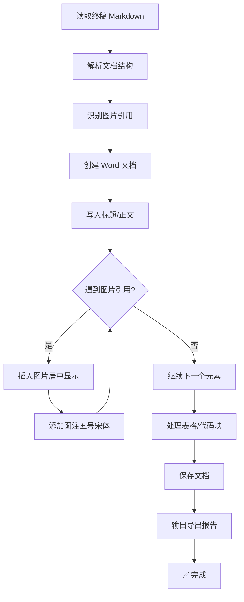

# Step 9: 文档导出与图片插入

> **状态管理(强制执行)**：
> 1. 启动前：`python scripts/status_manager.py thesis-workspace/ --ensure`
> 2. 启动时：`python scripts/status_manager.py thesis-workspace/ --check-step 9`
> 3. 前置条件通过后：`--update-step 9 --action start`
> 4. 完成后：`--update-step 9 --action complete`
>
> **统一入口(推荐)**：`python scripts/lifecycle.py --workspace thesis-workspace/ --step 9 --event start|complete`

> **自动将图片插入到 Word 文档，并添加规范图注**

---

## 执行流程



---

## 图片插入特性

| 特性 | 说明 | 格式标准 |
|------|------|----------|
| 自动居中 | 图片居中显示 | `doc.add_picture()` + 段落居中 |
| 尺寸控制 | 自动计算，默认最大宽度 14cm、最大高度 12cm | 适合 A4 纸张 |
| 图注格式 | 五号宋体、居中 | 符合学术论文规范 |
| 路径解析 | 支持相对路径，自动 resolve 为绝对路径 | 处理 Windows 反斜杠 |
| 格式检查 | 仅支持 png/jpg/jpeg/gif/bmp/tiff/emf/wmf | 非法格式自动跳过 |
| 失败处理 | 图片不存在/格式不支持时插入红色占位文字 | 不中断导出流程 |

---

## 图片导出前校验(硬约束)

- 正文不得残留 [image_N]
- Markdown 图片引用对应的图片文件必须存在且非空
- 任一校验失败时必须阻断导出，先回到 Step 8 修复

---

## 执行命令

```bash
# 导出 Word 文档(自动插入图片)
PYTHONPATH=scripts python -m document_exporter --input workspace/final/论文终稿.md --output workspace/final/ --format docx

# 导出 PDF 文档
PYTHONPATH=scripts python -m document_exporter --input workspace/final/论文终稿.md --output workspace/final/ --format pdf

# 同时导出两种格式
PYTHONPATH=scripts python -m document_exporter --input workspace/final/论文终稿.md --output workspace/final/ --format both
```

---

## 导出成功示例

```
[信息] 正在读取: workspace/final/论文终稿.md
[成功] Word 文档已保存: workspace/final/论文终稿.docx
[信息] 成功插入 12 张图片
==================================================
[文档导出报告]
输入文件: workspace/final/论文终稿.md
输出目录: workspace/final/
导出时间: 20260411_194041
--------------------------------------------------
DOCX: [成功]
  路径: workspace/final/论文终稿.docx
  图片: 12 张已插入
==================================================
```

---

## 文档格式规范

- 页边距：上下 2.54cm，左右 3.17cm
- 正文字体：宋体 12pt
- 标题字体：黑体，一级标题 14pt，二级标题 12pt
- 行距：1.5 倍行距
- 首行缩进：0.74cm(两个字符)

---

## 输出文件

- `workspace/final/论文终稿.docx` - Word 文档(含图片)
- `workspace/final/论文终稿.pdf` - PDF 文档
- `workspace/final/导出报告.md` - 导出报告
